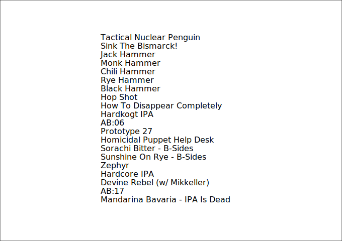
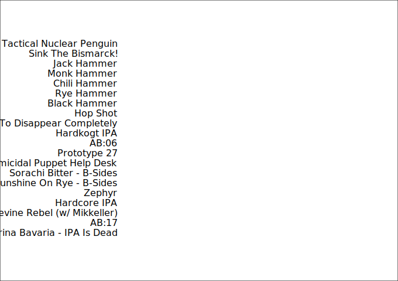
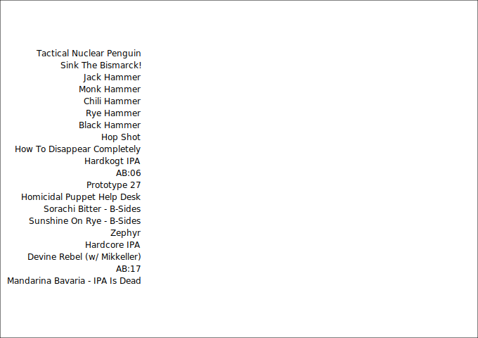

<div class="call-out-indigo">

This post is part of a series on data wrangling and visualisation with JavaScript.
You can find the other posts in the series at the links below.

- [Intro — Data Visualisation with Functional JavaScript](../data-wrangling-with-js)
- [Intro to D3](../intro-to-d3)
- [Binding Data with D3](../binding-data-d3)
- [D3 Scales](../d3-scales)
- [Horizontal Bar Plot with D3](../horizontal-bar-plot)
- [Higher Order Functions](../higher-order-functions)
- [Reducers and Transducers](../reducing-arrays)

</div>

Now that we're comfortable with the general syntax of D3, it's time to explore its true power: binding data to DOM elements.
Progressively working our way toward the goal of the horizontal bar chart below, this post introduces D3's `selection.data()` function, which is the key to binding an array of data to a selection of DOM elements.


Altogether, there are three data-bound components in this chart: the horizontal bars, the X-axis, and the Y-axis.
In addition to the `data()` function, we're also going to learn how to use the `scaleBand()` function to simplify the generation of the chart's X and Y axes.

## Shaping the data

To produce the plot above, all we'll need is the `name` and `ibu` of each beer in the `beers` array from [earlier in the series](../data-wrangling-with-js).
Remember; IBU stands for International Bitterness Units; a metric that represents the bitterness of a beverage.
The higher the IBU, the more bitter the beer.

```js
const beers = JSON.parse(fs.readFileSync("./beers.json"))
```

`name` and `ibu` are both first-level properties for each beer in the `beers` array, so no [unnesting](../unnesting-arrays) is required this time.
Using `map()`, we can create a new array that contains only the `name` and `ibu` of each beer.

```js
const unsortedIBU = beers.map(beer => ({
  name: beer.name,
  ibu: beer.ibu,
}))
```

Next, we'll sort by _descending_ IBU, so that the most bitter beers occupy the first places in the array.

```js
const sortedIBU = unsortedIBU.sort((a, b) => b.ibu - a.ibu)
```

`sortedIBU` contains 325 beers.

```js
sortedIBU // Array(325) [{…}, {…}, {…}, {…}, {…}, …]
```

We're now going to use `slice()` to create a new array that contains only the 30 most bitter beers.

```js
const slicedIBU = sortedIBU.slice(0, 30)
```

With this array we're ready to get started on our plot.

```js
slicedIBU // Array(30) [{…}, {…}, {…}, {…}, {…}, …]
```

Pre-processing data before handing it over to D3 isn't strictly necessary, but it can help.
D3 can perform a certain amount of this work for us, but I find it's often easier to do this work explicitly myself.

## Binding beer names to `<text/>` elements

We'll begin by creating the SVG and appending a white background to it.

```js
const body = d3.select("body")

const svg = body
  .append("svg")
  .attr("xmlns", "http://www.w3.org/2000/svg")
  .attr("width", width)
  .attr("height", height)

svg
  .append("rect")
  .attr("height", height)
  .attr("width", width)
  .attr("x", 0)
  .attr("y", 0)
  .style("fill", "#fff")
  .style("stroke", "#000")
```

```js
svg.append("g") // New "group"
```

This object is a D3 `Selection` object, and we can see from the output above that it is a [`SVGSVGElement`](https://developer.mozilla.org/en-US/docs/Web/API/SVGSVGElement).

The way that data binding in D3 works is that we first need to tell D3 what kind of DOM element we want to bind the data to.
These elements won't actually exist until we create them, and their number will depend on how many items exist in the array that they will be bound to.

> `Selection { _groups: [ [ SVGElement {} ] ], _parents: [ null ] }`

Appending a new group will return the Selection object shown above.

```js
svg.append("g").selectAll("text") // Empty selection
```

Selecting all (not yet existing) `<text/>` elements in this group using `selectAll()` will return an empty `NodeList`, shown below.
If there were any existing `<text/>` elements, this would be the first step in modifying or removing them.

> `Selection { _groups: [ NodeList {} ], _parents: [ SVGElement {} ] }`

The `data()` method will bind this empty `NodeList` to the data.

```js
svg
  .append("g") // New "group"
  .selectAll("text")
  .data(ibu)
```

But we're not quite done yet.
We now have 20 empty DOM nodes, but we'll need to specify the form that each one should take.

```js
Selection {
  _groups: [ [ <20 empty items> ] ],
  _parents: [ SVGElement {} ],
  _enter: [
    [
      [EnterNode], [EnterNode],
      [EnterNode], [EnterNode],
      [EnterNode], [EnterNode],
      [EnterNode], [EnterNode],
      [EnterNode], [EnterNode],
      [EnterNode], [EnterNode],
      [EnterNode], [EnterNode],
      [EnterNode], [EnterNode],
      [EnterNode], [EnterNode],
      [EnterNode], [EnterNode]
    ]
  ],
  _exit: [ [] ]
}
```

By chaining-up the `enter()`, `append()` and `text()` methods, and using `text()` as a map function that takes a callback, we can point D3 to exactly the values in our data that should be appended as `<text/>` elements to the `<group/>`.

```js
const text = svg
  .append("g")
  .selectAll("text")
  .data(ibu)
  .enter()
  .append("text")
  .text(beer => beer.name)
```

How did we do?
Let's take a look.


We now have the Y-axis labels appearing in our document, but as they aren't yet properly positioned, we can only just see them.
Before we get to positioning the labels, I've included a deep-dive into what exactly makes up the axis labels group in the blue box below.
Feel free to skip ahead if you're not interested in the inner-workings of D3 Selections.

## Spotlight: D3 Selections

In the box below, we'll examine D3 Selection object that we created above (`text`).

<div class="grid grid-cols-1 lg:grid-cols-3 call-out-indigo">
  <div>

### `text`

Printing the `text` variable will show us exactly what makes up this D3 Selection object.
The only problem is that all it tells us at this level is that the selection contains a SVG group that holds twenty SVG elements.

```js
Selection {
  _groups: [
    [
      [SVGElement], [SVGElement],
      [SVGElement], [SVGElement],
      [SVGElement], [SVGElement],
      [SVGElement], [SVGElement],
      [SVGElement], [SVGElement],
      [SVGElement], [SVGElement],
      [SVGElement], [SVGElement],
      [SVGElement], [SVGElement],
      [SVGElement], [SVGElement],
      [SVGElement], [SVGElement]
    ]
  ],
  _parents: [ SVGElement {} ]
}
```

  </div>
  <div>

### `text._groups`

Looking deeper into the `_groups` property reveals that the SVG element each have their own `data` property.

```js
[
  [
    SVGElement { __data__: [Object] },
    SVGElement { __data__: [Object] },
    SVGElement { __data__: [Object] },
    SVGElement { __data__: [Object] },
    SVGElement { __data__: [Object] },
    SVGElement { __data__: [Object] },
    SVGElement { __data__: [Object] },
    SVGElement { __data__: [Object] },
    SVGElement { __data__: [Object] },
    SVGElement { __data__: [Object] },
    SVGElement { __data__: [Object] },
    SVGElement { __data__: [Object] },
    SVGElement { __data__: [Object] },
    SVGElement { __data__: [Object] },
    SVGElement { __data__: [Object] },
    SVGElement { __data__: [Object] },
    SVGElement { __data__: [Object] },
    SVGElement { __data__: [Object] },
    SVGElement { __data__: [Object] },
    SVGElement { __data__: [Object] }
  ]
]
```

  </div>
  <div>

### `text._groups.flatMap(x => x)`

We can use `flatMap()` to surface the data that we're looking for.

```js
[
  SVGElement {
    __data__: { name: 'Tactical Nuclear Penguin', value: 1157 }
  },
  SVGElement { __data__: { name: 'Sink The Bismarck!', value: 1085 } },
  SVGElement { __data__: { name: 'Jack Hammer', value: 250 } },
  SVGElement { __data__: { name: 'Monk Hammer', value: 250 } },
  SVGElement { __data__: { name: 'Chili Hammer', value: 250 } },
  SVGElement { __data__: { name: 'Rye Hammer', value: 250 } },
  SVGElement { __data__: { name: 'Black Hammer', value: 250 } },
  SVGElement { __data__: { name: 'Hop Shot', value: 250 } },
  SVGElement {
    __data__: { name: 'How To Disappear Completely', value: 198 }
  },
  SVGElement { __data__: { name: 'Hardkogt IPA', value: 175 } },
  SVGElement { __data__: { name: 'AB:06', value: 150 } },
  SVGElement { __data__: { name: 'Prototype 27', value: 149 } },
  SVGElement {
    __data__: { name: 'Homicidal Puppet Help Desk', value: 132 }
  },
  SVGElement {
    __data__: { name: 'Sorachi Bitter - B-Sides', value: 130 }
  },
  SVGElement {
    __data__: { name: 'Sunshine On Rye - B-Sides', value: 130 }
  },
  SVGElement { __data__: { name: 'Zephyr', value: 125 } },
  SVGElement { __data__: { name: 'Hardcore IPA', value: 125 } },
  SVGElement {
    __data__: { name: 'Devine Rebel (w/ Mikkeller)', value: 100 }
  },
  SVGElement { __data__: { name: 'AB:17', value: 100 } },
  SVGElement {
    __data__: { name: 'Mandarina Bavaria - IPA Is Dead', value: 100 }
  }
]
```

  </div>
</div>

## Positioning the Y-axis labels

The labels are sitting above the plot area, so we'll need to bring them downward according to our specified margins.

```js
text.attr("y", (x, i) => margin.top + i * (plotHeight / ibu.length))
```

`text.attr()` accepts a callback that offers two arguments —one of them being an iterator (`i` above).
This callback will be run for each text element, and in this case we're telling each element to take-on a `y` value that's a function of `i`.



It's looking better.
Let's now set the `x` offset.

```js
text.attr("x", margin.left)
```


Great!
We're almost done.
These last steps are stylistic, and we'll begin be setting the orientation of the text (`text-anchor`).

```js
text.attr("text-anchor", "end")
```



Next, we'll set the font to `sans-serif`; which is uniersally supported, so we don't need to install any fonts.

```js
text.style("font-family", "sans-serif")
```


Woah; that's a little on the large side.
Let's take the size down a notch to `12px`.

```js
text.style("font-size", "12px")
```



Perfect!
We're almost ready to [put it all together](../horizontal-bar-plot), but there's one more thing we'll need to learn about before we can do that.
I'm refering to D3 scales, which we'll dig into in the [next post in this series](../d3-scales).
