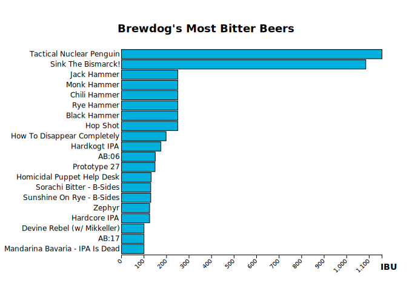
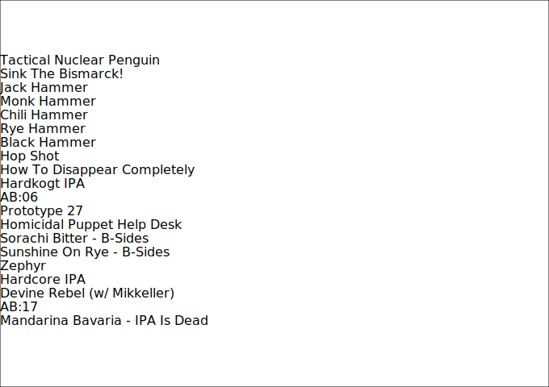
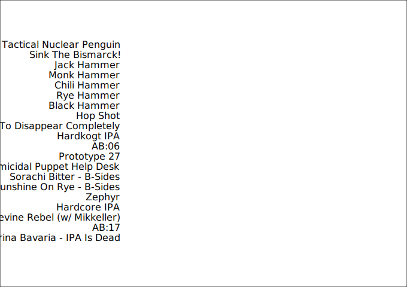

<div class="call-out-indigo">

This post is part of a series on data wrangling and visualisation with JavaScript.
You can find the other posts in the series at the links below.

- [Intro — Data Wrangling and Visualisation with JavaScript](../data-wrangling-with-js)
- [Pt. I — Unnesting Arrays](../unnesting-arrays)
- [Pt. II — Reducing Arrays](../reducing-arrays)
- [Pt. III — Intro to D3](../intro-to-d3)
- [Pt. IV — Binding data with D3](../binding-data-d3)
- [Pt. V — D3 Scales](../d3-scales)
- [Pt. VI — Horizontal Bar Plot With D3](../horizontal-bar-plot)

</div>

Now that we're comfortable with the general syntax of D3, it's time to explore its true power: binding data to DOM elements.
Working toward our goal of the horizontal bar chart below, this post introduce the `selection.data()` function as the key to binding an array of data to a selection of DOM elements.



Altogether, there are three data-bound components in this chart: the horizontal bars, the X-axis, and the Y-axis.
In addition to the `data()` function, we're also going to learn how to use the `scaleBand()` function to simplify the generation of the chart's X and Y axes.

## Shaping the data

To produce the plot above, all we'll need is the `name` and `ibu` of each beer in the `beers` array from [earlier in the series](../data-wrangling-with-js).
Remember; IBU stands for International Bitterness Units; a metric that represents the bitterness of a beverage.
The higher the IBU, the more bitter the beer.

```js
const beers = JSON.parse(fs.readFileSync("./beers.json"))
```

`name` and `ibu` are both first-level properties for each beer in the `beers` array, so no [unnesting](../unnesting-arrays) is required this time.
Using `map()`, we can create a new array that contains only the `name` and `ibu` of each beer.

```js
const unsortedIBU = beers.map(beer => ({
  name: beer.name,
  ibu: beer.ibu,
}))
```

Next, we'll sort by _descending_ IBU, so that the most bitter beers occupy the first places in the array.

```js
const sortedIBU = unsortedIBU.sort((a, b) => b.ibu - a.ibu)
```

`sortedIBU` contains 325 beers.

```js
sortedIBU // Array(325) [{…}, {…}, {…}, {…}, {…}, …]
```

We're now going to use `slice()` to create a new array that contains only the 30 most bitter beers.

```js
const slicedIBU = sortedIBU.slice(0, 30)
```

With this array we're ready to get started on our plot.

```js
slicedIBU // Array(30) [{…}, {…}, {…}, {…}, {…}, …]
```

Pre-processing data before handing it over to D3 isn't strictly necessary, but it can help.
D3 can perform a certain amount of this work for us, but I find it's often easier to do this work explicitly myself.

## Binding beer names to `<text/>` elements

We'll begin by creating the SVG and appending a white background to it.

```js
const body = d3.select("body")

const svg = body
  .append("svg")
  .attr("xmlns", "http://www.w3.org/2000/svg")
  .attr("width", width)
  .attr("height", height)

svg
  .append("rect")
  .attr("height", height)
  .attr("width", width)
  .attr("x", 0)
  .attr("y", 0)
  .style("fill", "#fff")
  .style("stroke", "#000")
```

```js
svg.append("g") // New "group"
```

This object is a D3 `Selection` object, and we can see from the output above that it is a [`SVGSVGElement`](https://developer.mozilla.org/en-US/docs/Web/API/SVGSVGElement).

The way that data binding in D3 works is that we first need to tell D3 what kind of DOM element we want to bind the data to.
These elements won't exist until we create them, and their number will depend on how many items exist in the array that they will be bound to.

```
Selection { _groups: [ [ SVGElement {} ] ], _parents: [ null ] }
```

```js
svg.append("g").selectAll("text") // Empty selection
```

```
Selection { _groups: [ NodeList {} ], _parents: [ SVGElement {} ] }
```

```js
svg
  .append("g") // New "group"
  .selectAll("text")
  .data(ibu)
```

```js
Selection {
  _groups: [ [ <20 empty items> ] ],
  _parents: [ SVGElement {} ],
  _enter: [
    [
      [EnterNode], [EnterNode],
      [EnterNode], [EnterNode],
      [EnterNode], [EnterNode],
      [EnterNode], [EnterNode],
      [EnterNode], [EnterNode],
      [EnterNode], [EnterNode],
      [EnterNode], [EnterNode],
      [EnterNode], [EnterNode],
      [EnterNode], [EnterNode],
      [EnterNode], [EnterNode]
    ]
  ],
  _exit: [ [] ]
}
```

```js
const text = svg
  .append("g")
  .selectAll("text")
  .data(ibu)
  .enter()
  .append("text")
  .text(beer => beer.name)
```

```js
Selection {
  _groups: [
    [
      [SVGElement], [SVGElement],
      [SVGElement], [SVGElement],
      [SVGElement], [SVGElement],
      [SVGElement], [SVGElement],
      [SVGElement], [SVGElement],
      [SVGElement], [SVGElement],
      [SVGElement], [SVGElement],
      [SVGElement], [SVGElement],
      [SVGElement], [SVGElement],
      [SVGElement], [SVGElement]
    ]
  ],
  _parents: [ SVGElement {} ]
}
```

```js
text._groups
```

```js
[
  [
    SVGElement { __data__: [Object] },
    SVGElement { __data__: [Object] },
    SVGElement { __data__: [Object] },
    SVGElement { __data__: [Object] },
    SVGElement { __data__: [Object] },
    SVGElement { __data__: [Object] },
    SVGElement { __data__: [Object] },
    SVGElement { __data__: [Object] },
    SVGElement { __data__: [Object] },
    SVGElement { __data__: [Object] },
    SVGElement { __data__: [Object] },
    SVGElement { __data__: [Object] },
    SVGElement { __data__: [Object] },
    SVGElement { __data__: [Object] },
    SVGElement { __data__: [Object] },
    SVGElement { __data__: [Object] },
    SVGElement { __data__: [Object] },
    SVGElement { __data__: [Object] },
    SVGElement { __data__: [Object] },
    SVGElement { __data__: [Object] }
  ]
]
```

```js
text._groups.flatMap(x => x)
```

```js
[
  SVGElement {
    __data__: { name: 'Tactical Nuclear Penguin', value: 1157 }
  },
  SVGElement { __data__: { name: 'Sink The Bismarck!', value: 1085 } },
  SVGElement { __data__: { name: 'Jack Hammer', value: 250 } },
  SVGElement { __data__: { name: 'Monk Hammer', value: 250 } },
  SVGElement { __data__: { name: 'Chili Hammer', value: 250 } },
  SVGElement { __data__: { name: 'Rye Hammer', value: 250 } },
  SVGElement { __data__: { name: 'Black Hammer', value: 250 } },
  SVGElement { __data__: { name: 'Hop Shot', value: 250 } },
  SVGElement {
    __data__: { name: 'How To Disappear Completely', value: 198 }
  },
  SVGElement { __data__: { name: 'Hardkogt IPA', value: 175 } },
  SVGElement { __data__: { name: 'AB:06', value: 150 } },
  SVGElement { __data__: { name: 'Prototype 27', value: 149 } },
  SVGElement {
    __data__: { name: 'Homicidal Puppet Help Desk', value: 132 }
  },
  SVGElement {
    __data__: { name: 'Sorachi Bitter - B-Sides', value: 130 }
  },
  SVGElement {
    __data__: { name: 'Sunshine On Rye - B-Sides', value: 130 }
  },
  SVGElement { __data__: { name: 'Zephyr', value: 125 } },
  SVGElement { __data__: { name: 'Hardcore IPA', value: 125 } },
  SVGElement {
    __data__: { name: 'Devine Rebel (w/ Mikkeller)', value: 100 }
  },
  SVGElement { __data__: { name: 'AB:17', value: 100 } },
  SVGElement {
    __data__: { name: 'Mandarina Bavaria - IPA Is Dead', value: 100 }
  }
]
```

## Appending the `<text/>`

```js
const text = svg
  .selectAll("text") // Create an empty array
  .data(ibu) // Fill the array with "empty" data bindings
  .enter() // What does this do?
  .append("text")
  .text(beer => beer.name)
```


```js
text.attr("x", margin.left)
```


```js
text.attr("y", (x, i) => margin.top + i * (plotHeight / ibu.length))
```



```js
text.attr("text-anchor", "end")
```


```js
text.style("font-family", "sans-serif")
```



```js
text.style("font-size", "12px")
```


