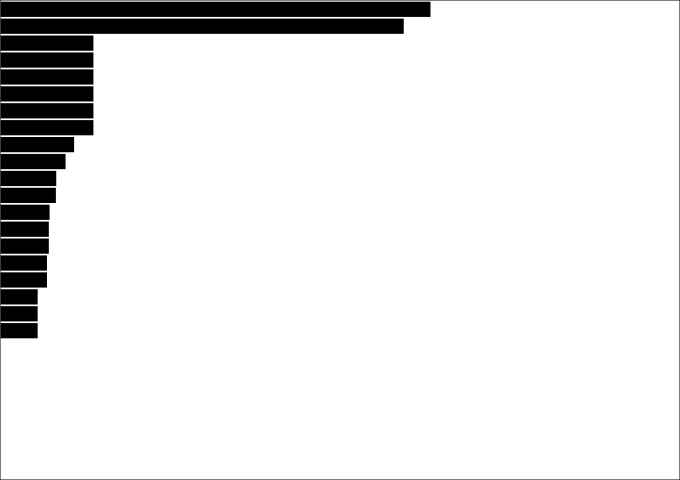
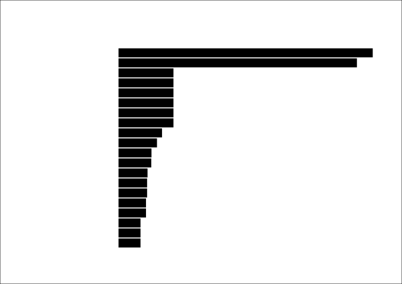
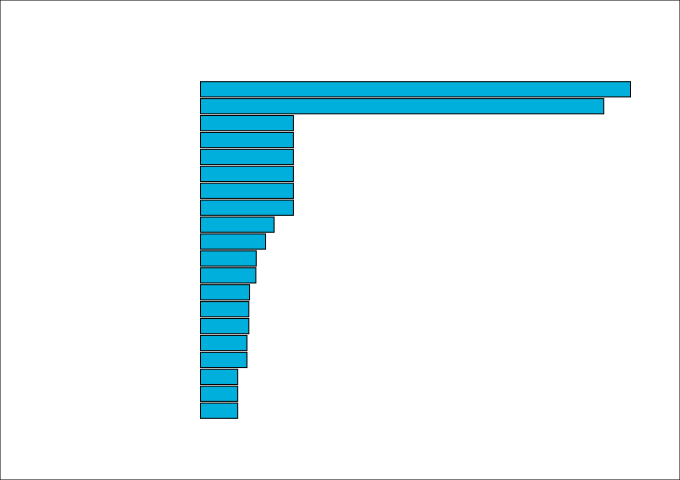

<div class="call-out-indigo">

This post is part of a series on data wrangling and visualisation with JavaScript.
You can find the other posts in the series at the links below.

- [Intro — Data Visualisation with Functional JavaScript](../data-wrangling-with-js)
- [Intro to D3](../intro-to-d3)
- [Binding Data with D3](../binding-data-d3)
- [D3 Scales](../d3-scales)
- [Horizontal Bar Plot with D3](../horizontal-bar-plot)
- [Higher Order Functions](../higher-order-functions)
- [Reducers and Transducers](../reducing-arrays)

</div>

```js
let bars = outlineSVG.append("g").selectAll("rect").data(ibu).join("rect")
```


```js
const scaleX = d3
  .scaleLinear()
  .domain([0, ibu.at(0).value])
  .range([0, plotWidth])
```

> _What is `scaleX`?_

```js
[Function: scale] {
  invert: [Function (anonymous)],
  domain: [Function (anonymous)],
  range: [Function (anonymous)],
  rangeRound: [Function (anonymous)],
  clamp: [Function (anonymous)],
  interpolate: [Function (anonymous)],
  unknown: [Function (anonymous)],
  copy: [Function (anonymous)],
  ticks: [Function (anonymous)],
  tickFormat: [Function (anonymous)],
  nice: [Function (anonymous)]
}
```

```js
const scaleY = d3
  .scaleBand()
  .range([0, plotHeight])
  .domain(ibu.map(x => x.name))
  .padding(0.1) // Adds space between the bars
```

Returns same function as scaleX...
And we can use it to set the width and height according to the IBU values.

```js
bars.attr("height", scaleY.bandwidth())
bars.attr("width", data => scaleX(data.value))
```


```js
bars.attr("x", 0.5) // Half pixel?
bars.attr("y", data => scaleY(data.name))
```



```js
bars.attr("transform", `translate(${margin.left}, ${margin.top})`)
```



```js
bars.attr("fill", "#00AFDB")
```


```js
bars.style("stroke", "#000")
```


