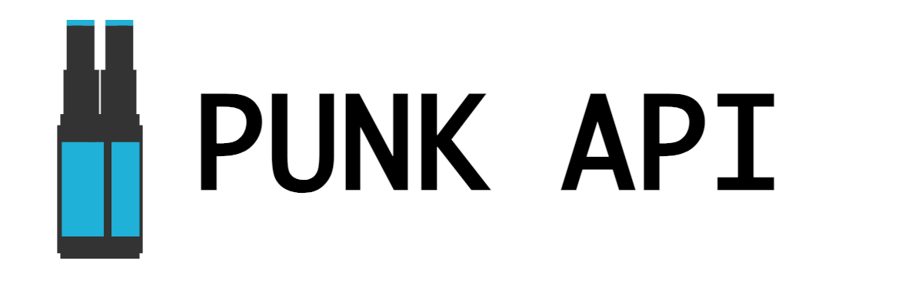

Data wrangling can be one of the most rewarding tasks in programming.
I'm constantly searching for ways to make my data pipelines cleaner and faster, and in this post I outline a technique that I'm developing for simultaniously unnesting and reducing data.
In short; I'll be reducing an array of 325 objects into an array of 166 _unique_ strings.

This is the first post in a series.
We'll first examine the step-by-step process of surfacing and unnesting the names of the hops that Brewdog uses in its beer, and as we progress we'll develop a pattern that can combine multiple array permutations into a single step.

- [Pt. I — Unnesting Arrays](../unnesting-arrays)
- [Pt. II — Reducing Arrays](../reducing-arrays)
- [Pt. III — Horizontal Bar Plot With D3.js](../horizontal-bar-plot)
- [Bonus — Paginated Fetch](../paginated-fetch)

## A dataset of 325 beers!

Brewdog is a highly successful brewery in Scotland.
They maintain a public REST API that can be used to query a database of their entire beer catalogue.



Let's have a look at the data.
I requested this data from the [Punk API](https://punkapi.com/), and stored it in a variable called `beers`, shown below.

## Querying a paginated REST API

```js
const beers = JSON.parse(fs.readFileSync("./beers.json"))
```

## Exploring the data

As you can see; this array contains 325 beers.
I want to compile an array of all hops used by Brewdog.

```js
beers // Array(325) [{…}, {…}, {…}, {…}, {…}, …]
```

```js
Object.getOwnPropertyNames(beers[1])
```

To do that, I'll need to surface the hops data from each beer object.
We can see the first beer below.
There's a lot to it, but what I'm looking for is nested deep-down under `ingredients.hops`.

<div class="sm-text">

```json
{
    "id": 192,
    "name": "Punk IPA 2007 - 2010",
    "tagline": "Post Modern Classic. Spiky. Tropical. Hoppy.",
    "first_brewed": "04/2007",
    "description": "Our flagship beer that kick started the craft beer revolution. This is James and Martin's original take on an American IPA, subverted with punchy New Zealand hops. Layered with new world hops to create an all-out riot of grapefruit, pineapple and lychee before a spiky, mouth-puckering bitter finish.",
    "image_url": "https://images.punkapi.com/v2/192.png",
    "abv": 6.0,
    "ibu": 60.0,
    "target_fg": 1010.0,
    "target_og": 1056.0,
    "ebc": 17.0,
    "srm": 8.5,
    "ph": 4.4,
    "attenuation_level": 82.14,
    "volume": {
      "value": 20,
      "unit": "liters"
    },
    "boil_volume": {
      "value": 25,
      "unit": "liters"
    },
    "method": {
      "mash_temp": [
        {
          "temp": {
            "value": 65,
            "unit": "celsius"
          },
          "duration": 75
        }
      ],
      "fermentation": {
        "temp": {
          "value": 19.0,
          "unit": "celsius"
        }
      },
      "twist": null
    },
    "ingredients": {
      "malt": [
        {
          "name": "Extra Pale",
          "amount": {
            "value": 5.3,
            "unit": "kilograms"
          }
        }
      ],
      "hops": [
        {
          "name": "Ahtanum",
          "amount": {
            "value": 17.5,
            "unit": "grams"
           },
           "add": "start",
           "attribute": "bitter"
         },
         {
           "name": "Chinook",
           "amount": {
             "value": 15,
             "unit": "grams"
           },
           "add": "start",
           "attribute": "bitter"
         },
         ...
      ],
      "yeast": "Wyeast 1056 - American Ale™"
    },
    "food_pairing": [
      "Spicy carne asada with a pico de gallo sauce",
      "Shredded chicken tacos with a mango chilli lime salsa",
      "Cheesecake with a passion fruit swirl sauce"
    ],
    "brewers_tips": "While it may surprise you, this version of Punk IPA isn't dry hopped but still packs a punch! To make the best of the aroma hops make sure they are fully submerged and add them just before knock out for an intense hop hit.",
    "contributed_by": "Sam Mason <samjbmason>"
  }
```

</div>

`ingredients.hops` is an array of hops objects that outline the which hops are used in the brew, and at which point in the process they're added, along with what their effect on the recipe is.
The original Punk IPA uses only two hops, Ahtanum and Chinook, shown below.

<div class="sm-text">

```json
[
  {
    "name": "Ahtanum",
    "amount": {
      "value": 17.5,
      "unit": "grams"
    },
    "add": "start",
    "attribute": "bitter"
  },
  {
    "name": "Chinook",
    "amount": {
      "value": 15,
      "unit": "grams"
    },
    "add": "start",
    "attribute": "bitter"
  }
]
```

</div>

Each of the beers in the dataset contains at least one hop.
Considering that these beers all come from the same brewery, we can expect many of the beers to have hops in common.  
More on that in a moment.
