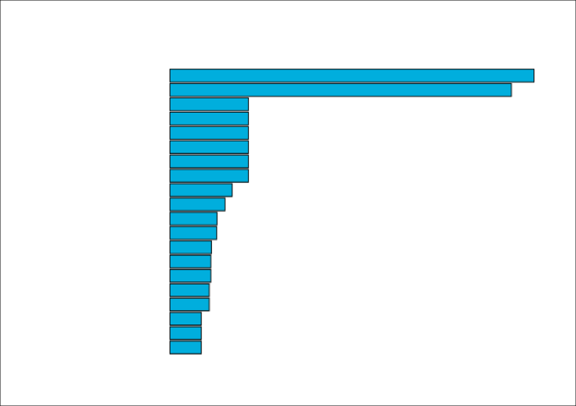

<div class="call-out-indigo">

This is the first post in a series about data wrangling and visualisation with JavaScript.
It's here for experienced developers who want to expand their toolkit with a few versitle tools; namely D3.js, and functional patterns for array manipulation.

You can find the other posts in this series at the links below.

- [Intro — Data Visualisation with Functional JavaScript](../data-wrangling-with-js)
- [Intro to D3](../intro-to-d3)
- [Binding Data with D3](../binding-data-d3)
- [D3 Scales](../d3-scales)
- [Horizontal Bar Plot with D3](../horizontal-bar-plot)
- [Higher Order Functions](../higher-order-functions)
- [Reducers and Transducers](../reducing-arrays)

The best way to engage with this series is to code along.
We've done our very best to approach each piece of code with a step-by-step visualisation of what's happening, but you'll want to already be familliar with ES6 array methods before you try to weed through this series.

</div>

## The Approach

This series is constructed around the [Punk API](./punk_api.png)'s data set of brewing production data.


If you aren't familliar with the Punk API, it's a REST API maintained by Brewdog, a popular Scottish brewery.
This API can be used to query a data set of Brewdog's entire beer catalogue.

Over the course of this series, we'll work with this data to produce several visualisations like the one below using [D3.js](https://d3js.org/).


The approach that we'll take is to break-down the steps involved in creating each plot into illustrated, digestible pieces.



## The Data: 325 beers!

Let's have a look at the data that we'll be exploring and using throughout this series.

```js
beers // Array(325) [{…}, {…}, {…}, {…}, {…}, …]
```

We've outlined how to query this data from the API in [another post](../paginated-fetch), but all you need to know for this series is that `beers` is an array of 325 objects.
Each object has the the following properties:

<div class="sm-text">

```json
[
  "id",
  "name",
  "tagline",
  "first_brewed",
  "description",
  "image_url",
  "abv",
  "ibu",
  "target_fg",
  "target_og",
  "ebc",
  "srm",
  "ph",
  "attenuation_level",
  "volume",
  "boil_volume",
  "method",
  "ingredients",
  "food_pairing",
  "brewers_tips",
  "contributed_by"
]
```

</div>

Over the course of this series we'll be creating new arrays from `beers` that restructure to suit the plots that we'll create.
For example; to produce the hoizonal bar plot shown above, we'll create an array of only the name and IBU value of each beer.

## Nested Data

Several of the object properties above contain nested arrays, and much of the functional programming patterns that we'll cover will serve the purpose of performantly unnesting these nested arrays.

For example, `ingredients.hops` contains an array of two hops: "Ahtanum" and "Chinook".
In a later post, we'll create a new array containing the hops from each beer.

<div class="sm-text">

```json
[
  {
    "name": "Ahtanum",
    "amount": {
      "value": 17.5,
      "unit": "grams"
    },
    "add": "start",
    "attribute": "bitter"
  },
  {
    "name": "Chinook",
    "amount": {
      "value": 15,
      "unit": "grams"
    },
    "add": "start",
    "attribute": "bitter"
  }
]
```

</div>

If you're already familliar with the terminology of functional programming, we'll be exploring higher-order functions, as well as currying.
But if you aren't yet familliar with these patterns, don't sweat; they aren't very complicated, and we'll get you through them.

## Data Visualisation

This project is ongoing, but here are the plots that it contains so far:

- Horizontal Bar Plot
- Scatterplot
- Facetplot

As time goes on though, we hope to expand this list to more or less every kind of visualisation that can be found in Claus Wilke's ["Fundamentals of Data Visualization"](https://clauswilke.com/dataviz/).

## Getting started

It's our belief that the world has so far only scratched the surface when it comes to data's potential to transform society for the better.
We're excited to expand our own data visualisation toolkit, and this series is borne out of our own learning process.
We're excited to share it with you, and hope that you're get as much out of reading it as we did out of writing it.

We'll begin by diving into [the basics of D3](../intro-to-d3) in the next post.
This will be our platform for the rest of the series.
