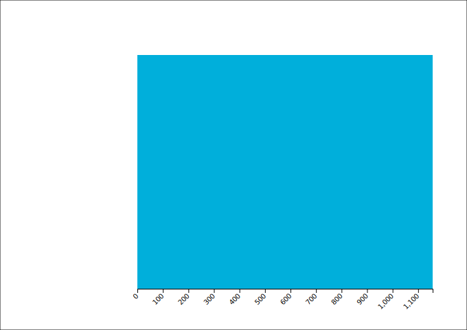

For this part of the series, we're going to plot the IBU of Brewdog's 30 most bitter beers.
IBU stands for International Bitterness Units, and the higher the IBU, the more bitter the taste of the beer.


First-up, let's get our data.
For this plot, all we'll need is the `name` and `ibu` of each beer.

These are both top-level properties, so while we don't _need_ to do this first step, I it feels cleaner to me to start with creating an array that contains only the `name` and `ibu` —without any of the other beer properties.

```js
const beers = JSON.parse(fs.readFileSync("./beers.json"))

const unsortedIBU = beers.map(beer => ({
  name: beer.name,
  ibu: beer.ibu,
}))
```

```js
unsortedIBU // Array(325) [{…}, {…}, {…}, {…}, {…}, …]
```

Next, we'll sort by _descending_ IBU...

```js
const sortedIBU = unsortedIBU.sort((a, b) => b.ibu - a.ibu)
```

```js
sortedIBU // Array(325) [{…}, {…}, {…}, {…}, {…}, …]
```

And finally, we'll use `slice()` to return just the first 30 beers.

```js
const slicedIBU = sortedIBU.slice(0, 30)
```

```js
slicedIBU // Array(30) [{…}, {…}, {…}, {…}, {…}, …]
```

## D3.js

D3 exists to give you full control over every minute detail of your chart.
You shouldn't use it for charts that you're not interested in customizing, because it can get quite tedious.

Example...

One thing to understand about working with D3 is that every possible detail of your chart needs to be declared.
Libraries that are built on top of D3 take the opposite approach, where you get an out-of-the-box chart, and you specify which parts to remove.

This means that D3 code often looks like crap.
In this post, we're going to attempt to keep our code clean using the functional patterns that we've already used.

You have to consider a D3 chart as the sum of it's components.
For our purposes, that's a title, two axes, the plotted data, and an axis label.

One other thing that you'll have to learn to accept is that D3 code often feels very inefficent, in my opinion.
In a sense, however, it's clear why.
When we're creating a visualisation, we're not writing a program.
Instead, we're painting an often highly customized piece of data-driven art.
The kind of beautiful output that is worthy of publication in the New York Times or the Economist.

```js
import * from "d3"
```

D3 gives us a simplified way to dynamically generate SVG markup for our visualisations.
The final product then gets attached to whatever document we're working on, or output to a file.

```js
const margin = { top: 80, right: 50, bottom: 60, left: 200 }
const width = 680
const height = 480

const svg = body
  .append("svg")
  .attr("xmlns", "http://www.w3.org/2000/svg")
  .attr("width", width)
  .attr("height", height)
```

// Drawing a box around the whole thing

```js
const documentOutline = svg
  .append("rect")
  .attr("height", height)
  .attr("width", width)
  .attr("x", 0)
  .attr("y", 0)
  .style("stroke", "#000")
  .style("fill", "none")
```


```js
outline // Selection { _groups: [ [ [SVGElement] ] ], _parents: [ null ] }
```

```js
const plotHeight = height - margin.top - margin.bottom
const plotWidth = width - margin.left - margin.right
```

```js
const plotOutline = svg
  .append("rect")
  .attr("x", margin.left)
  .attr("y", margin.top)
  .attr("height", plotHeight)
  .attr("width", plotWidth)
  .style("fill", "#00AFDB")
```


```js
const x = d3
  .scaleLinear()
  .domain([0, ibu.at(0).value])
  .range([0, plotWidth])
```

What is `x`?

```js
[Function: scale] {
  invert: [Function (anonymous)],
  domain: [Function (anonymous)],
  range: [Function (anonymous)],
  rangeRound: [Function (anonymous)],
  clamp: [Function (anonymous)],
  interpolate: [Function (anonymous)],
  unknown: [Function (anonymous)],
  copy: [Function (anonymous)],
  ticks: [Function (anonymous)],
  tickFormat: [Function (anonymous)],
  nice: [Function (anonymous)]
}
```

We're about to use the `d3.axisBottom()` function.
This function returns a fucntion...

```js
[Function: axis] {
  scale: [Function (anonymous)],
  ticks: [Function (anonymous)],
  tickArguments: [Function (anonymous)],
  tickValues: [Function (anonymous)],
  tickFormat: [Function (anonymous)],
  tickSize: [Function (anonymous)],
  tickSizeInner: [Function (anonymous)],
  tickSizeOuter: [Function (anonymous)],
  tickPadding: [Function (anonymous)],
  offset: [Function (anonymous)]
}
```

```js
const axisX = svg
  .append("g") // new "group"
  .attr("transform", `translate(0, ${plotHeight})`)
  .call(d3.axisBottom(x))
```

`axisX` ? What is it?

```js
Selection { _groups: [ [ [SVGElement] ] ], _parents: [ null ] }
```


Then rotate the text

```js
axisX
  .selectAll("text")
  .attr("transform", "translate(-10,0)rotate(-45)")
  .style("text-anchor", "end")
```


And fix the alignment...

```js
axisX.attr("transform", `translate(${margin.left}, ${plotHeight + margin.top})`)
```



Add a title...

```js
svg
  .append("text")
  .attr("x", width / 2)
  .attr("y", margin.top / 2)
  .attr("text-anchor", "middle")
  .text("Brewdog's Most Bitter Beers")
  .style("font-size", "18px")
  .style("font-weight", "bold")
```


Add an X axis label

```js
svg
  .append("text")
  .attr("text-anchor", "end")
  .attr("x", margin.left + plotWidth + 25)
  .attr("y", margin.top + plotHeight + 25)
  .text("IBU")
  .style("font-size", "14px")
  .style("font-weight", "bold")
```


```js
const y = d3
  .scaleBand()
  .range([0, plotHeight])
  .domain(ibu.map(x => x.name))
  .padding(0.1) // Adds space between the bars
```

```js
const axisY = d3.axisLeft(y)
```

```js
[Function: axis] {
  scale: [Function (anonymous)],
  ticks: [Function (anonymous)],
  tickArguments: [Function (anonymous)],
  tickValues: [Function (anonymous)],
  tickFormat: [Function (anonymous)],
  tickSize: [Function (anonymous)],
  tickSizeInner: [Function (anonymous)],
  tickSizeOuter: [Function (anonymous)],
  tickPadding: [Function (anonymous)],
  offset: [Function (anonymous)]
}
```

```js
const yNoTicks = d3.axisLeft(y).tickSize(0)
```

```js
svg
  .append("g")
  .call(yNoTicks)
  .attr("transform", `translate(${margin.left}, ${margin.top})`)
  .style("font-size", "12px")
  .style("font-weight", "light")
  .style("fill", "#000")
  .style("stroke", "none")
```


Remove the outlines

```js
// Remove the two existing rects
documentOutline.remove()
plotOutline.remove()
```


And finally, remove the Y axis domain line

```js
axisY.call(g => g.select(".domain").remove())
```


## Recap

```js
svg
```

```js
Selection { _groups: [ [ SVGSVGElement {} ] ], _parents: [ null ] }
```

```js
svg
```

```js
Selection { _groups: [ [ SVGSVGElement {} ] ], _parents: [ null ] }
```

```js
svg.append("g") // new "group"
```

```js
Selection { _groups: [ [ SVGElement {} ] ], _parents: [ null ] }
```

```js
svg.append("g").selectAll("rect")
```

```js
Selection { _groups: [ NodeList {} ], _parents: [ SVGElement {} ] }
```

```js
svg.append("g").selectAll("rect").data(ibu)
```

```js
Selection {
  _groups: [ [ <20 empty items> ] ],
  _parents: [ SVGElement {} ],
  _enter: [
    [
      [EnterNode], [EnterNode],
      [EnterNode], [EnterNode],
      [EnterNode], [EnterNode],
      [EnterNode], [EnterNode],
      [EnterNode], [EnterNode],
      [EnterNode], [EnterNode],
      [EnterNode], [EnterNode],
      [EnterNode], [EnterNode],
      [EnterNode], [EnterNode],
      [EnterNode], [EnterNode]
    ]
  ],
  _exit: [ [] ]
}
```

```js
svg.append("g").selectAll("rect").data(ibu).join("rect")
```

```js
Selection {
  _groups: [
    [
      [SVGElement], [SVGElement],
      [SVGElement], [SVGElement],
      [SVGElement], [SVGElement],
      [SVGElement], [SVGElement],
      [SVGElement], [SVGElement],
      [SVGElement], [SVGElement],
      [SVGElement], [SVGElement],
      [SVGElement], [SVGElement],
      [SVGElement], [SVGElement],
      [SVGElement], [SVGElement]
    ]
  ],
  _parents: [ SVGElement {} ]
}
```

```js
svg
  .append("g")
  .selectAll("rect")
  .data(ibu)
  .join("rect")
  .attr("x", 0.5) // Half pixel?
  .attr("y", data => y(data.name))
  .attr("width", data => x(data.value))
  .attr("height", y.bandwidth())
  .attr("fill", "#00AFDB")
  .style("stroke", "#000")
```

```js
.attr("y", data => {
  console.log(y(data.name))

  return y(data.name)
})
```

```js
1.990049751243788
21.8905472636816
41.79104477611941
61.69154228855723
81.59203980099504
101.49253731343285
121.39303482587067
141.29353233830847
161.1940298507463
181.0945273631841
200.9950248756219
220.89552238805973
240.79601990049755
260.69651741293535
280.5970149253732
300.497512437811
320.3980099502488
340.29850746268664
360.19900497512447
380.0995024875622
```

```js
y.bandwidth()
```

```js
17.910447761194032
```


<div class="call-out-indigo">

## 32% ABV!?

<iframe title="vimeo-player" src="https://player.vimeo.com/video/7812379?h=1c9cd7ede5" width="640" height="360" frameborder="0" allowfullscreen></iframe>

</div>
