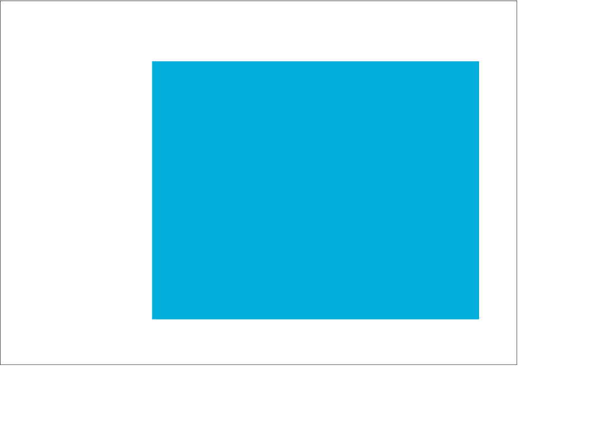

<div class="call-out-indigo">

This post is part of a series on data wrangling and visualisation with JavaScript.
It explores data from the [Punk API](../data-wrangling-with-js), and uses it to plot asthetically pleasing charts with D3.js.
You can find a list of the other posts in this series [here](../data-wrangling-with-js)

</div>

For this part of the series, we're going to make a horizontal bar plot using D3.js.
I've broken the steps into an easy-to follow sequence, so if you're new to D3, this is a great place to get oriented with how to use it.
The plot below is what we'll be creating in this post.


IBU stands for International Bitterness Units.
It's a metric that represents the bitterness of a drink.
The higher the IBU, the more bitter the beer.

We'll be going through this process in a step-by-step manner, which you can see a preview of below.



## The data

We're working with an array that represents 30 beers, shown below.

```json
[
  { "name": "Tactical Nuclear Penguin", "ibu": 1157 },
  { "name": "Sink The Bismarck!", "ibu": 1085 }
  // ... 28 more items
]
```

This array contains everything that we need to plot the horizontal bar chart.
Each object has two properties: `name` and `ibu`.
If you'd like to see how this array came to be, I encourage you to look back on the earlier posts about [binding data](../binding-data-d3) and [D3 scales](../d3-scales).

## Boilerplate

Let's set-up our SVG and append it to the document that we're working with.
If you need help with the code below, check-out the [introduction to this series](../data-wrangling-with-js).

```js
const width = 680
const height = 480

const svg = body
  .append("svg")
  .attr("xmlns", "http://www.w3.org/2000/svg")
  .attr("width", width)
  .attr("height", height)
```

Now that our SVG element is appended to the document's body, let's add a full-height-and-width white background and black border to it.
This is purely to help us get oriented with where the different elements of our plot will go, and we'll remove it once we've put our axes in place.
Keep the variable name `documentOutline` in mind, as we'll need to reference that name when we're ready to remove the outline.

```js
const documentOutline = svg
  .append("rect")
  .attr("height", height)
  .attr("width", width)
  .attr("x", 0)
  .attr("y", 0)
  .style("stroke", "#000")
  .style("fill", "none")
```


Let's also create another temporary outline that indicates where the horizontal bars will eventually go.

```js
const margin = { top: 80, right: 50, bottom: 60, left: 200 }
const plotHeight = height - margin.top - margin.bottom
const plotWidth = width - margin.left - margin.right

const plotOutline = svg
  .append("rect")
  .attr("x", margin.left)
  .attr("y", margin.top)
  .attr("height", plotHeight)
  .attr("width", plotWidth)
  .style("fill", "#00AFDB")
```

Creating variables for `plotHeight` and `plotWidth` will help us when it comes time to create and position other elements of the chart like axis labels, and even the horizontal bars themselves.


## Using a scale to plot the X axis

In another post, we used D3 scales to [calculate the width and height of plot elements from data](../d3-scales).
We're going to apply that same technique here to create our plot axes.

Remember that data set of 30 beer objects that we're working with.
It's ordered by _descending_ `value`.  
Here's a look at that first array item once again:

```js
ibu[0] // { "name": "Tactical Nuclear Penguin", "ibu": 1157 }
```

We create a scale in D3 by calling a scale function —in this case `scaleLinear()` —and providing it with a domain and a range.
In this case, the domain is derived from the values `0` and `1157`, because we want the axis to begin at 0 and go all the way to the largest value in the data set, `1157`.
The range goes from `0` to `430`, because we want the axis line to begin at 0 and go the full length of `plotWidth`.

```js
const scaleX = d3
  .scaleLinear()
  .domain([0, ibu.at(0).value])
  .range([0, plotWidth])
```

We can generate everything we need for the X axis by calling `d3.axisBottom(scaleX)`.
This function will take care of positioning all axis ticks and labels properly.
If you've read the [post on binding data to DOM elements](../binding-data-d3) you'll appreciate how much `axisBottom()` and `axisLeft()` simplify the axis generation process.

```js
const axisX = svg
  .append("g")
  .attr("transform", `translate(0, ${plotHeight})`)
  .call(d3.axisBottom(scaleX))

axisX // Selection { _groups: [ [ [SVGSVGElement] ] ], _parents: [ null ] }
```


<div class="call-out-indigo">

## A note about `call()`

The `call()` method will invoke the axis function and append the axis to the SVG.
In the block above we "call" `d3.axisBottom(scaleX)` from the `svg.append("g")` method chain.
The code below will do _almost_ the same thing, but with one major difference:

```js
const axisX = d3.axisBottom(scaleX)(
  svg.append("g").attr("transform", `translate(0, ${plotHeight})`)
)

axisX // undefined
```

The difference being that `call()` will always return the selection that invoked it; thus keeping the method chain intact.
If we never intend to reference `axisX` in our code, then we're free to use the syntax that doesn't return the selection.
But if we do want to reference `axisX` later in our code, then we'll need to initialize it using the `call()` method.

</div>

This is just a personal preference, but I find that rotating the X axis tick labels by 45 degrees adds a flare of elegance and increases the readablility of the chart.
Since `axisX` is a D3 selection, chaining-up a call to `selectAll("text")` will select the `<text/>` elements that are contained within the axis.

```js
axisX
  .selectAll("text")
  .attr("transform", "translate(-10,0)rotate(-45)")
  .style("text-anchor", "end")
```


We'll also want to position the axis to it's proper place, along the bottom edge of the plot area.

```js
axisX.attr("transform", `translate(${margin.left}, ${plotHeight + margin.top})`)
```


## Adding text

No chart is complete without it's title, and that's exactly what we'll add to our chart now.
Simply append a new `<text/>` element to the chart, position and style it properly, and set it's inner-text to something descriptive.

```js
svg
  .append("text")
  .attr("x", width / 2)
  .attr("y", (margin.top / 3) * 2)
  .attr("text-anchor", "middle")
  .text("Brewdog's Most Bitter Beers")
  .style("font-size", "18px")
  .style("font-weight", "bold")
```

Setting `attr("y", (margin.top / 3) * 2)` will position the text about two-thirds of the way between the top edge of the chart and the top edge of the plot area.


Next, we'll add an X axis label that can tell anyone viewing the chart what those numbers below the axis represent.

```js
svg
  .append("text")
  .attr("text-anchor", "end")
  .attr("x", margin.left + plotWidth + 25)
  .attr("y", margin.top + plotHeight + 25)
  .text("IBU")
  .style("font-size", "14px")
  .style("font-weight", "bold")
```


## Using a scale to plot the Y axis

`axisBottom()` returns a number of methods that can be used to customize the axis.
These are shown below, and later-on we'll use the `tickSize` method to remove the ticks from the Y axis.

```js
[Function: axis] {
  scale: [Function (anonymous)],
  ticks: [Function (anonymous)],
  tickArguments: [Function (anonymous)],
  tickValues: [Function (anonymous)],
  tickFormat: [Function (anonymous)],
  tickSize: [Function (anonymous)],
  tickSizeInner: [Function (anonymous)],
  tickSizeOuter: [Function (anonymous)],
  tickPadding: [Function (anonymous)],
  offset: [Function (anonymous)]
}
```

We're now going to use a scale to do the work that was done manually in the previous post on [binding data to text elements](../d3-scales).
In the code below, we're creating a scale for the Y axis using the names of the beers, and then setting it's `range` to the plot height.

```js
const scaleY = d3
  .scaleBand()
  .range([0, plotHeight])
  .domain(ibu.map(x => x.name))
  .padding(0.1) // Adds space between the bars
```

Earlier in this post we used `d3.axisBottom()` to generate the X axis.
We'll now use a similar function, `axisLeft()`, to generate the Y axis.

Remember; these functions gives us several methods that we can chain to customize the axis.

```js
[Function: axis] {
  scale: [Function (anonymous)],
  ticks: [Function (anonymous)],
  tickArguments: [Function (anonymous)],
  tickValues: [Function (anonymous)],
  tickFormat: [Function (anonymous)],
  tickSize: [Function (anonymous)],
  tickSizeInner: [Function (anonymous)],
  tickSizeOuter: [Function (anonymous)],
  tickPadding: [Function (anonymous)],
  offset: [Function (anonymous)]
}
```

The `tickSize()` method will let us customize the size of the axis ticks, and setting them to `0` will remove them from the axis.

```js
const axisY = svg
  .append("g")
  .call(d3.axisLeft(scaleY).tickSize(0))
  .attr("transform", `translate(${margin.left}, ${margin.top})`)
  .style("font-size", "12px")
  .style("font-weight", "light")
  .style("fill", "#000")
  .style("stroke", "none")
```


We're almost ready to plot our data, but before we do that, we'll need to remove the blue plot outline placeholder from our chart.

## Removing selections from a chart

`documentOutline` is a D3 `Selection` object, and we can use this variable later-on to select and remove the element when that time comes.

```js
documentOutline // Selection { _groups: [ [ [SVGElement] ] ], _parents: [ null ] }
```

Before we can plot the data, we'll need to remove that blue `<rect/>` that we created to indicate where the plot would go.
We can remove that element, along with the think black border around the chart by selecting them (`documentOutline` and `plotOutline`) and calling `remove()` on each.

```js
documentOutline.remove()
plotOutline.remove()
```

This works because these variables refer to D3 Selection objects.
Selection objects refert to DOM elements, and whenever we create a new DOM element in D3, the function that we use to create it (i.e. `svg.append("rect")`) will return a Selection object that is bound to the element that we just created.


While we're at it, let's also remove the Y axis domain line.
This can be done by selecting the Y axis (`axisY`), and calling an anonymous function that removes whatever `.domain` element happens to be nested inside of `axisY`.

```js
axisY.call(g => g.select(".domain").remove())
```

The horizonal bars that we're going to plot each have a black border, so the Y axis domain line _isn't_ necessary, and I think the chart will look better without it.


## Plotting the data

This next step was covered in-depth in [the post that introduced D3 scales](../d3-scales).
But to briefly review what's happening below, we're using the X and Y axis scales to set the width and height of each horizontal bar.

The code below creates and positions a new `<group/>` element that contains the bars, but without specifying the `width` and `height` attribute of each bar, we won't actually see the bars yet.

```js
const bars = svg
  .append("g")
  .attr("transform", `translate(${margin.left}, ${margin.top})`)
  .selectAll("rect")
  .data(ibu)
  .join("rect")
```

The code above will add those elements to the document, but we won't actually see them unless we give them each a `width` and a `height`.

```js
bars.attr("width", data => scaleX(data.value))
```

`selection.attr()` can accept an anonymous function as it's second argument.
This function will be run once for each item in the bound data set (`ibu`, in this case).
The function's argument (`data`) is an item of the bound data.  
Think of this as a mapping function that will calculate the width of each bar from the data set's values.

```js
bars.attr("height", scaleY.bandwidth())
```

We're also using another scale method (`bandwidth()`) to calculate the height of each bar.  
`scaleY.bandwidth()` returns the number `17.910447761194032`, which is the `plotHeight` divided by the number of items in the dataset —but also accounting for the `0.1` of padding that we specified when we created the Y axis scale!
Imagine having to account for that level of detail without the help of D3.


Specifying the width and height of the rectangles will make them visible to us, but we quickly see that isn't all it's going to take.

## Positioning the bars

By default, each bar has the x and y positions of `[0, 0]`, which leaves them appearing on-top of each other.
We can show this behavior more clearly by styling the bars, shown below:

```js
bars.attr("fill", "#00AFDB").style("stroke", "#000")
```

> "There you are! — D3 Mystery Gang


> "And we would've gotten away with it too, if it weren't for you meddling D3 kids!" — Bars

Positioning those bars is a breeze, thanks to `scaleY()`.
Just plug in `data.name`, and that's it!
It will return a calculated Y position for each bar.

```js
bars.attr("y", data => scaleY(data.name))
```

You can see a log of the calculated Y positions below:

```
1.990049751243788
21.8905472636816
41.79104477611941
61.69154228855723
81.59203980099504
101.49253731343285
121.39303482587067
141.29353233830847
161.1940298507463
181.0945273631841
200.9950248756219
220.89552238805973
240.79601990049755
260.69651741293535
280.5970149253732
300.497512437811
320.3980099502488
340.29850746268664
360.19900497512447
380.0995024875622
```


## Offsetting the `x` domain

We're _almost_ done...
There's just one pesky little detail to take care of.
You may have not even noticed it, so let's take a closer look.


The circle above outlines the domain origins of the X and Y axis.
We removed the Y axis domain line earlier in this post to create a stylized look for the chart.
The black left stroke of each bar now replaces the single Y axis domain line, but as we can see in the outline above, the bars are mis-aligned by half a pixel.

We can clear that up by setting the `x` property of the whole bar group to `0.5`.

```js
bars.attr("x", 0.5)
```


> "Much better."

We can see the entire code for the horizontal bars below.

```js
svg
  .append("g")
  .attr("transform", `translate(${margin.left}, ${margin.top})`)
  .selectAll("rect")
  .data(ibu)
  .join("rect")
  .attr("width", data => scaleX(data.value))
  .attr("height", scaleY.bandwidth())
  .attr("y", data => scaleY(data.name))
  .attr("x", 0.5)
  .attr("fill", "#00AFDB")
  .style("stroke", "#000")
```

And there we have it.
A beautiful and informative chart that shows us the IBU of Brewdog's most bitter beers.

Did you notice that the most bitter beer, "Tactical Nuclear Penguin" has an IBU of almost 1200?
I couldn't believe it at first, and assumed it must have been a an error in the data.
I looked it up though, and found this hilarious video about how that beer came to be.
It turns out that the alcohol content of that beer is an alarming 32%! 😅

<iframe title="vimeo-player" src="https://player.vimeo.com/video/7812379?h=1c9cd7ede5" width="640" height="360" frameborder="0" allowfullscreen></iframe>
