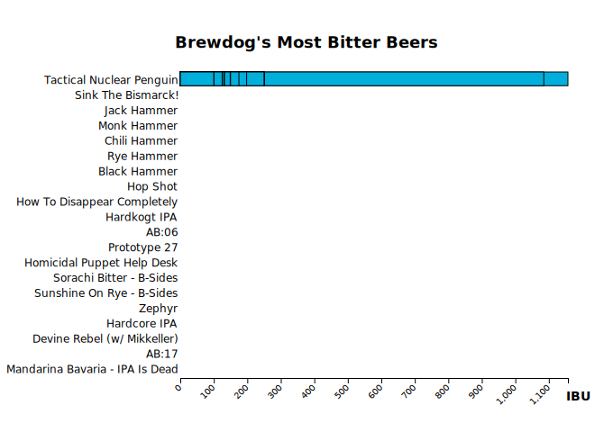

<div class="call-out-indigo">

This post is part of a series on data wrangling and visualisation with JavaScript.
It explores data from the [Punk API](../data-wrangling-with-js), and uses it to plot asthetically pleasing charts with D3.js.
You can find the other posts in this series at the links below.

- [Intro — Data Visualisation with Functional JavaScript](../data-wrangling-with-js)
- [Pt. I — Intro to D3](../intro-to-d3)
- [Pt. II — Binding Data with D3](../binding-data-d3)
- [Pt. III — D3 Scales](../d3-scales)
- [Pt. IV — Horizontal Bar Plot with D3](../horizontal-bar-plot)
- [Pt. V — Higher Order Functions](../higher-order-functions)
- [Pt. VII — Scatterplot with D3](../scatter-plot)
- [Pt. VIII — Reducers and Transducers](../reducing-arrays)
- [Pt. IX — Facetplot with D3](../facet-plot)

</div>

For this part of the series, we're going to make a horizontal bar plot using D3.js.
I've broken the steps into an easy-to follow sequence, so if you're new to D3, this is a great place to get oriented with how to use it.
The plot below is what we'll be creating in this post.


IBU stands for International Bitterness Units.
It's a metric that represents the bitterness of a drink.
The higher the IBU, the more bitter the beer.

Below, we can see an animated breakdown of each part that makes up this chart.


## The data

We're working with an array of 30 beer objects, shown below.

```js
ibu // Array(30) [{…}, {…}, {…}, {…}, {…}, …]
```

This array contains everything that we need to plot the horizontal bar chart above.
Each object has two properties: `name` and `ibu`.

```json
{
  "name": "Punk IPA 2007 - 2010",
  "ibu": 60.0
}
```

If you'd like to see how this array came to be, I encourage you to look back on the earlier posts about [../binding-data-d3](binding data) and [../d3-scales](D3 scales).

## Creating the SVG object

Let's set-up our SVG and append it to the document that we're working with.

```js
const width = 680
const height = 480

const svg = body
  .append("svg")
  .attr("xmlns", "http://www.w3.org/2000/svg")
  .attr("width", width)
  .attr("height", height)
```

Now that our SVG element has been appended to the document's body, let's add a full-height-and-width white background to it, with a black border.
We'll remove this element later-on, but for the purpose of this step-by-step tutorial, I find it helpful because it shows us the boundary of the SVG.

```js
const documentOutline = svg
  .append("rect")
  .attr("height", height)
  .attr("width", width)
  .attr("x", 0)
  .attr("y", 0)
  .style("stroke", "#000")
  .style("fill", "none")
```


`documentOutline` is a D3 `Selection` object, and we can use this variable later-on to select and remove the element when that time comes.

```js
documentOutline // Selection { _groups: [ [ [SVGElement] ] ], _parents: [ null ] }
```

We'll also create an outline that shows us where our data will be plotted, relative to the margins of the chart.

```js
const margin = { top: 80, right: 50, bottom: 60, left: 200 }
const plotHeight = height - margin.top - margin.bottom
const plotWidth = width - margin.left - margin.right

const plotOutline = svg
  .append("rect")
  .attr("x", margin.left)
  .attr("y", margin.top)
  .attr("height", plotHeight)
  .attr("width", plotWidth)
  .style("fill", "#00AFDB")
```

We'll also remove this blue box later-on.


## Using a scale to plot the X axis

In the previous post, we used scales to [calculate the width and height of elements based on the IBU data](../d3-scales).
We're now going to apply that same technique to calculate our plot axes too.

The X axis scale begins at `[0, 100]` and extends to `[0, 430]`.
`100` is the lowest `value` in the IBU array, and `430` is the full-width of the plot area.

```js
const scaleX = d3
  .scaleLinear()
  .domain([0, ibu.at(0).value])
  .range([0, plotWidth])
```

We can generate everything we need for the X axis by calling `d3.axisBottom(scaleX)`.
This function will take care of positioning all axis ticks and labels properly.
Readers who have read the [post where we created the Y axis manually](../binding-data-d3) may appreciate just how much `axisBottom()` and `axisLeft()` simplify this process.

The `call()` method will invoke the axis function and append the axis to the SVG.

```js
const axisX = svg
  .append("g") // new "group"
  .attr("transform", `translate(0, ${plotHeight})`)
  .call(d3.axisBottom(scaleX))
```


`axisBottom()` also returns a number off methods that we can use for customizing this axis.
These are shown below, and later-on we'll use the `tickSize` method to remove the ticks from the Y axis.

```js
[Function: axis] {
  scale: [Function (anonymous)],
  ticks: [Function (anonymous)],
  tickArguments: [Function (anonymous)],
  tickValues: [Function (anonymous)],
  tickFormat: [Function (anonymous)],
  tickSize: [Function (anonymous)],
  tickSizeInner: [Function (anonymous)],
  tickSizeOuter: [Function (anonymous)],
  tickPadding: [Function (anonymous)],
  offset: [Function (anonymous)]
}
```

Before we get to the Y axis though, I'd like to rotate the X axis labels by 45 degrees.
This is just a personal preference, but I find this rotation to add a flare of elegance to the chart.

```js
axisX
  .selectAll("text")
  .attr("transform", "translate(-10,0)rotate(-45)")
  .style("text-anchor", "end")
```

`selectAll()` will select all `<text/>` elements contained within the current selection (`axisX`), and we can then transform and translate those elements however we see fit.


Speaking of `"transform"`, we'll also need to position the axis to it's proper place, along the bottom edge of the plot area.

```js
axisX.attr("transform", `translate(${margin.left}, ${plotHeight + margin.top})`)
```


## Adding text

No chart is complete without it's title, and that's exactly what we'll add to our chart now.
Simply append a new `<text/>` element to the chart, position and style it properly, and set it's inner-text to something descriptive.

```js
svg
  .append("text")
  .attr("x", width / 2)
  .attr("y", (margin.top / 3) * 2)
  .attr("text-anchor", "middle")
  .text("Brewdog's Most Bitter Beers")
  .style("font-size", "18px")
  .style("font-weight", "bold")
```

Setting `attr("y", (margin.top / 3) * 2)` will position the text about two-thirds of the way between the top edge of the chart and the top edge of the plot area.


Next, we'll add an X axis label that can tell anyone viewing the chart what those numbers below the axis represent.

```js
svg
  .append("text")
  .attr("text-anchor", "end")
  .attr("x", margin.left + plotWidth + 25)
  .attr("y", margin.top + plotHeight + 25)
  .text("IBU")
  .style("font-size", "14px")
  .style("font-weight", "bold")
```


## Using a scale to plot the Y axis

We're now going to use a scale to do the work that was done manually in the previous post on [binding data to text elements](../d3-scales).
In the code below, we're creating a scale for the Y axis using the names of the beers, and then setting it's `range` to the plot height.

```js
const scaleY = d3
  .scaleBand()
  .range([0, plotHeight])
  .domain(ibu.map(x => x.name))
  .padding(0.1) // Adds space between the bars
```

Earlier in this post we used `d3.axisBottom()` to generate the X axis.
We'll now use a similar function, `axisLeft()`, to generate the Y axis.

Remember; these functions gives us several methods that we can chain to customize the axis.

```js
[Function: axis] {
  scale: [Function (anonymous)],
  ticks: [Function (anonymous)],
  tickArguments: [Function (anonymous)],
  tickValues: [Function (anonymous)],
  tickFormat: [Function (anonymous)],
  tickSize: [Function (anonymous)],
  tickSizeInner: [Function (anonymous)],
  tickSizeOuter: [Function (anonymous)],
  tickPadding: [Function (anonymous)],
  offset: [Function (anonymous)]
}
```

The `tickSize()` method will let us customize the size of the axis ticks, and setting them to `0` will remove them from the axis.

```js
const axisY = svg
  .append("g")
  .call(d3.axisLeft(scaleY).tickSize(0))
  .attr("transform", `translate(${margin.left}, ${margin.top})`)
  .style("font-size", "12px")
  .style("font-weight", "light")
  .style("fill", "#000")
  .style("stroke", "none")
```


We're almost ready to plot our data, but before we do that, we'll need to remove the blue plot outline placeholder from our chart.

## Removing selections from a chart

Before we can plot the data, we'll need to remove that blue `<rect/>` that we created to indicate where the plot would go.
We can remove that element, along with the think black border around the chart by selecting them (`documentOutline` and `plotOutline`) and calling `remove()` on each.

```js
documentOutline.remove()
plotOutline.remove()
```

This works because these variables refer to D3 Selection objects.
Selection objects refert to DOM elements, and whenever we create a new DOM element in D3, the function that we use to create it (i.e. `svg.append("rect")`) will return a Selection object that is bound to the element that we just created.


While we're at it, let's also remove the Y axis domain line.
This can be done by selecting the Y axis (`axisY`), and calling an anonymous function that removes whatever `.domain` element happens to be nested inside of `axisY`.

```js
axisY.call(g => g.select(".domain").remove())
```

The horizonal bars that we're going to plot each have a black border, so the Y axis domain line _isn't_ necessary, and I think the chart will look better without it.


## Plotting the data

This next step was covered in-depth in [the post that introduced D3 scales](../d3-scales).
But to briefly review what's happening below, we're using the X and Y axis scales to set the width and height of each horizontal bar.

The code below creates and positions a new `<group/>` element that contains the bars, but without specifying the `width` and `height` attribute of each bar, we won't actually see the bars yet.

```js
const bars = svg
  .append("g")
  .attr("transform", `translate(${margin.left}, ${margin.top})`)
  .selectAll("rect")
  .data(ibu)
  .join("rect")
```

The code above will add those elements to the document, but we won't actually see them unless we give them each a `width` and a `height`.

```js
bars
  .attr("width", data => scaleX(data.value))
  .attr("height", scaleY.bandwidth())
```

Specifying the width and height of the rectangles will make them visible to us, but we quickly see that isn't all it's going to take.


```js
bars.attr("y", data => scaleY(data.name))
```


Styled...



This next part is quite nit-picky, but it's actually quite important.


```js
bars.attr("x", 0.5)
```


Putting it all together.

```js
svg
  .append("g")
  .attr("transform", `translate(${margin.left}, ${margin.top})`)
  .selectAll("rect")
  .data(ibu)
  .join("rect")
  .attr("width", data => scaleX(data.value))
  .attr("height", scaleY.bandwidth())
  .attr("y", data => scaleY(data.name))
  .attr("x", 0.5)
  .attr("fill", "#00AFDB")
  .style("stroke", "#000")
```

Specifically, we're using a scale method called `bandwidth()` to set the height of each bar.  
This returns the number `17.910447761194032`, which is the `plotHeight` divided by the number of items in `ibu` —but also accounting for the `0.1` of padding that we specified when we created the Y axis scale.

Setting `attr("x", 0.5)` is necessary because of the 1px black stroke we're using for the border of each bar.
Somehow bumping them by half a pixel to the right will set the left border to exactly where the axis domain line would have been.


There it is!
A beautiful and informative chart that shows us the IBU of Brewdog's most bitter beers.

<div class="call-out-indigo">

## A note about `scaleX()`

If, like I was, you're curious about how `attr("width", data => scaleX(data.value))` works; it returns the Y position of each item in `ibu`.
Each of these values is shown below.

```js
1.990049751243788
21.8905472636816
41.79104477611941
61.69154228855723
81.59203980099504
101.49253731343285
121.39303482587067
141.29353233830847
161.1940298507463
181.0945273631841
200.9950248756219
220.89552238805973
240.79601990049755
260.69651741293535
280.5970149253732
300.497512437811
320.3980099502488
340.29850746268664
360.19900497512447
380.0995024875622
```

This is just one of the many ways that D3 scales simplify the creation of plot axes over manually creating them ourselves.

</div>

Did you notice that the most bitter beer, "Tactical Nuclear Penguin" has an IBU of almost 1200?
I couldn't believe it at first, and assumed it must have been a an error in the data.
I looked it up though, just in case, and found this hilarious video about how they made that beer.
It turns out that the alcohol content of that beer is a whopping 32%!

<iframe title="vimeo-player" src="https://player.vimeo.com/video/7812379?h=1c9cd7ede5" width="640" height="360" frameborder="0" allowfullscreen></iframe>
