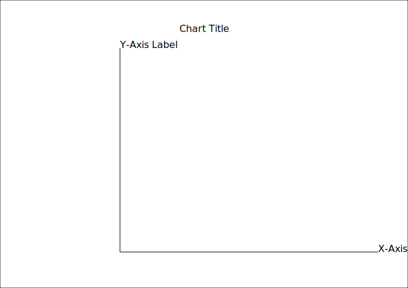
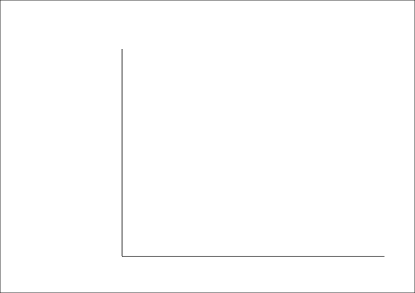
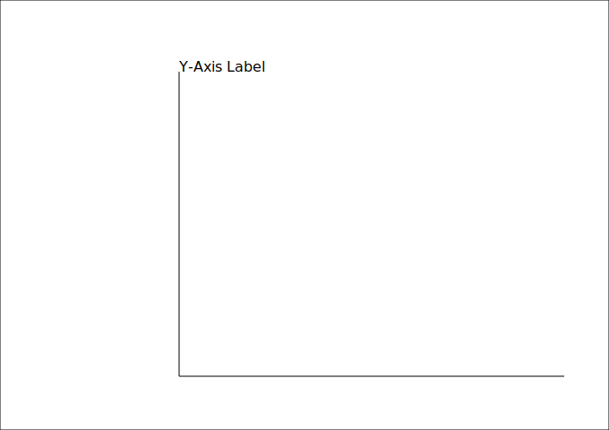
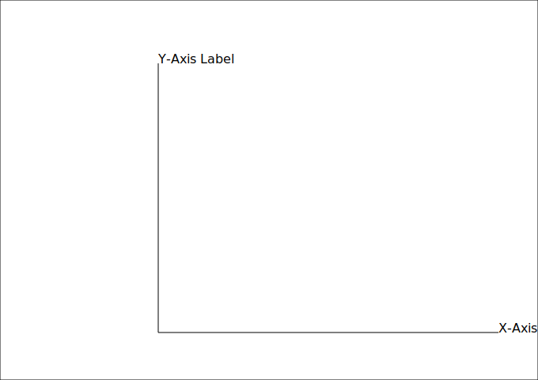

<div class="call-out-indigo">

This post is part of a series on data wrangling and visualisation with JavaScript.
You can find the other posts in the series at the links below.

- [Intro — Data Visualisation with Functional JavaScript](../data-wrangling-with-js)
- [Intro to D3](../intro-to-d3)
- [Binding Data with D3](../binding-data-d3)
- [D3 Scales](../d3-scales)
- [Horizontal Bar Plot with D3](../horizontal-bar-plot)
- [Higher Order Functions](../higher-order-functions)
- [Reducers and Transducers](../reducing-arrays)

</div>

For this part of the series, we're going to get our hands dirty with D3.js.

<svg version="1.1" xmlns="http://www.w3.org/2000/svg" width="150" height="150" viewBox="-10 -10 116 111">
  <clipPath id="clip">
    <path d="M0,0h7.75a45.5,45.5 0 1 1 0,91h-7.75v-20h7.75a25.5,25.5 0 1 0 0,-51h-7.75zm36.2510,0h32a27.75,27.75 0 0 1 21.331,45.5a27.75,27.75 0 0 1 -21.331,45.5h-32a53.6895,53.6895 0 0 0 18.7464,-20h13.2526a7.75,7.75 0 1 0 0,-15.5h-7.75a53.6895,53.6895 0 0 0 0,-20h7.75a7.75,7.75 0 1 0 0,-15.5h-13.2526a53.6895,53.6895 0 0 0 -18.7464,-20z"/>
  </clipPath>
  <linearGradient id="gradient-1" gradientUnits="userSpaceOnUse" x1="7" y1="64" x2="50" y2="107">
    <stop offset="0" stop-color="#f9a03c"/>
    <stop offset="1" stop-color="#f7974e"/>
  </linearGradient>
  <linearGradient id="gradient-2" gradientUnits="userSpaceOnUse" x1="2" y1="-2" x2="87" y2="84">
    <stop offset="0" stop-color="#f26d58"/>
    <stop offset="1" stop-color="#f9a03c"/>
  </linearGradient>
  <linearGradient id="gradient-3" gradientUnits="userSpaceOnUse" x1="45" y1="-10" x2="108" y2="53">
    <stop offset="0" stop-color="#b84e51"/>
    <stop offset="1" stop-color="#f68e48"/>
  </linearGradient>
  <g clip-path="url(#clip)">
    <path d="M-100,-102m-28,0v300h300z" fill="url(#gradient-1)"/>
    <path d="M-100,-102m28,0h300v300z" fill="url(#gradient-3)"/>
    <path d="M-100,-102l300,300" fill="none" stroke="url(#gradient-2)" stroke-width="40"/>
  </g>
</svg>

D3.js is JavaScript library for manipulating documents based-on data.
It's most common application is the creation of SVG data visualisations, but people use D3 for all kinds of non-traditional applications.
If you haven't seen it yet, check out the [D3 Gallery](https://observablehq.com/@d3/gallery) for inspiration.

I'm introducing this library, because we're going to use it to produce the horizontal bar chart below.


D3 exists to make it easier to dynamically create and manipulate DOM elements.
It gives us control of every minute detail of what we're trying to create.
As someone who occasionally "used" D3 for years without ever grasping it, I've seen my fair share of tutorials and sample D3 code on the internet.
What I'm going to do differently in these next three posts is to break-down the process step-by-step to show the progrogression of the visualisation with each new `append()` and each customization.

## Mocking a chart

Before we actually produce our first chart, we're going to mock-it.
By that, I mean that we're going to produce an SVG that represents the structure of the horizontal bar chart —without using any actual data.

The chart that we'll be plotting is simple, but styled.
It consists of two axes, an axis label, the plotted data, and —of course, a title.



The SVG above was made using D3, and the entry-point to creating an SVG, or any DOM element with D3 is the `append()` method.
The code below selects the `<body></body>` element of the document we're working with, and appends an `<svg></svg>` element to it.

```js
const outlineSVG = d3
  .select("body")
  .append("svg")
  .attr("xmlns", "http://www.w3.org/2000/svg")
```

I'm also defining the `xmlns` attribute of the SVG tag, which explicitly defines this new DOM element as an SVG.
This isn't necessary if you're creating an SVG that will be inserted directly into a web page, but if you want to create a standalone SVG file, you'll want to include it.

The following variables will be used to set the general size and layout of our chart.

```js
const width = 680
const height = 480
const margin = { top: 80, right: 50, bottom: 60, left: 200 }
```

In addition to `width` and `hight`, let's also create variables that define part of the chart that will feature the plotted data.

```js
const plotHeight = height - margin.top - margin.bottom
const plotWidth = width - margin.left - margin.right
```

If we want to define the `width` or the `height` of our SVG, we just need to tack-on another two `attr()` calls to our method chain.
In the code-block below, the three `attr()` calls apply to the SVG element, and not to the `<body></body>` tag that was selected with `select()`.
That's because whenever a new element is appended to an existing element, the scope of the subsequent method chains applies to the newly appended element.

```js
const outlineSVG = d3
  .select("body")
  .append("svg")
  .attr("xmlns", "http://www.w3.org/2000/svg")
  .attr("width", width)
  .attr("height", height)
```

We won't stop there though.
Let's also add a white background, and a black outline to the SVG.

```js
outlineSVG
  .append("rect")
  .attr("height", height)
  .attr("width", width)
  .attr("x", 0)
  .attr("y", 0)
  .style("fill", "#fff")
  .style("stroke", "#000")
```

In case you've never worked with SVGs, but you're familliar with CSS, note that the terminology is somewhat different.
Think of `fill` as the background color, and `stroke` as the border.
This is shown below, where we can see the thin black stroke around the vast white fill.


The next major concept to learn about D3 is that new elements are kind of like new layers in PhotoShop.
The code chunk below will create and append a new shape that will sit on-top of the white background that we created in the previous step.
This line represents the Y-axis.

```js
outlineSVG
  .append("line")
  .attr("x1", margin.left)
  .attr("y1", margin.top)
  .attr("x2", margin.left)
  .attr("y2", margin.top + plotHeight)
  .style("stroke", "#000")
```

However; had we created this `line` before we created the previous `rect`, we wouldn't see it because it would be hidden behind the `rect`.
There's no Z-index when it comes to SVG elements (though [workarounds](https://stackoverflow.com/questions/17786618/how-to-use-z-index-in-svg-elements) do exist).


Both the Y-axis line and the X-axis line are defined by setting the starting (`x1`, `y1`) and ending (`x2`, `y2`) coordinates of the line.

```js
outlineSVG
  .append("line")
  .attr("x1", margin.left)
  .attr("y1", margin.top + plotHeight)
  .attr("x2", margin.left + plotWidth)
  .attr("y2", margin.top + plotHeight)
  .style("stroke", "#000")
```

We'll later learn how to simplify the process of defining an axis using D3.



Text can be added to the document by appending a `<text/>` element and calling it's `.text()` method.

```js
outlineSVG
  .append("text")
  .attr("x", margin.left)
  .attr("y", margin.top)
  .text("Y-Axis Label")
```

Text elements only a have `x` and `y` attributes, unlike lines which have `x1`, `x2`, `y1`, and `y2`, attributes.



To add the X-axis label, we'll do exactly what we did to add the Y-axis label.

```js
outlineSVG
  .append("text")
  .attr("x", margin.left + plotWidth)
  .attr("y", margin.top + plotHeight)
  .text("X-Axis Label")
```

However, because this label appears too close to the right border of the SVG, it will be cut-off slightly.



Finally, we'll add our chart's title text.
`text-anchor` is similar to `vertical-align` in CSS.

```js
outlineSVG
  .append("text")
  .attr("text-anchor", "middle")
  .attr("x", width / 2)
  .attr("y", (margin.top / 3) * 2) // two-thirds
  .text("Chart Title")
```


And voila!
We've made our first SVG, which is a representation of the chart that we'll create in the next two posts.

Since we haven't yet looked-into using D3 to bind DOM elements to our data, we'll do that in the [next post](../binding-data-d3).
