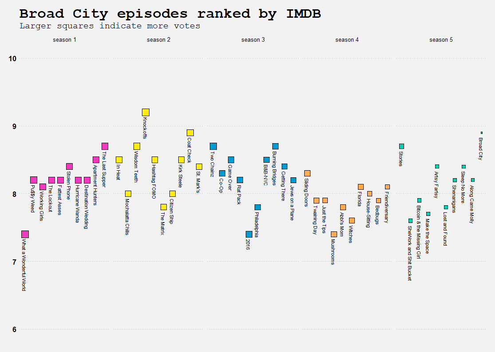
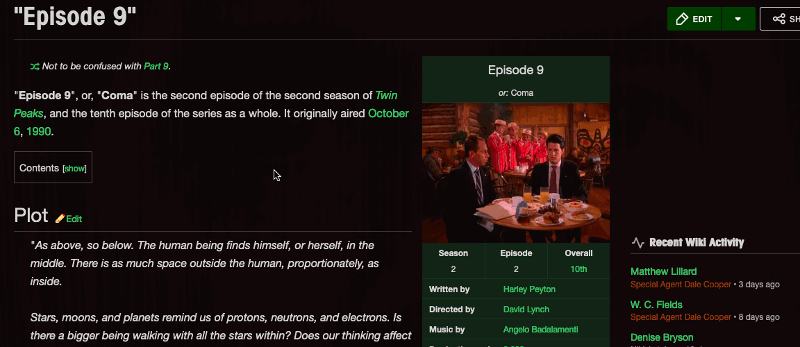
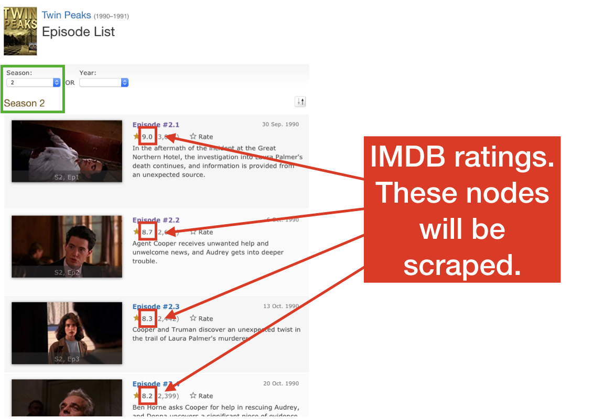
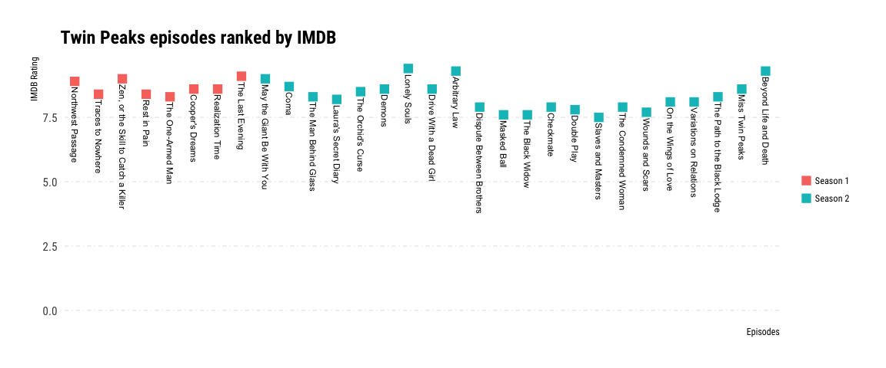
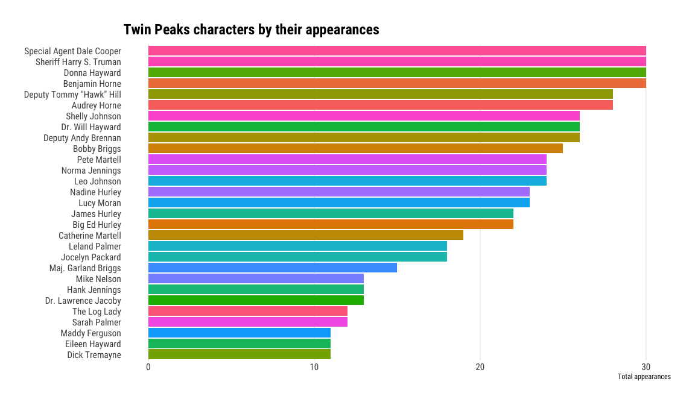

Being an employee of the EPFL Extension School has it’s perks.

For the past month, I’ve been following one of our courses, [“50 Things
You Need to Know About
Data”](https://exts.epfl.ch/courses-programs/50-things-you-need-to-know-about-data),
an introductory course designed to teach the basics of the tools and
technologies needed to work with data in the digital age.

Specifically, the course teaches how to store, structure, clean,
visualize, and analyze data using the R programming language —and it
provides a broad survey of topics like machine learning, data privacy,
and other topics as well. Having finally made my way through the
technical portion of the course, I thought that writing a data article
about my favorite show, Twin Peaks, would be the perfect opportunity to
put _some_ of what I learned in the course to the test.

Before we begin, I want to properly represent my technical background.
As a course developer for the Extension School, I create courses about
programming for web applications. My area of expertise is the JavaScript
programming language, and it’s been several years since I worked as a
business analyst using MS Excel spreadsheet software. A month ago I
wrote my first line of R code, and this course is the only instruction
that I pursued to learn R. But I do happen to share an office with the
creator of the course, Xavier, whose time and enthusiasm I owe to much
of my progress.

But despite my more advanced technical background, this course _is_ for
beginners. If you’ve worked with basic spreadsheets before, you’ll find
the material _very_ approachable. And sure; it helped to have Xavier
sitting at a desk across the room from me, but if you take the course
you’ll get to chat with him for a half-hour each week about any course
topic that you’d like to discuss.

This article won’t showcase _all_ of what I learned in the course. The
course teaches how to work with data from many different sources,
including databases, `.csv` files, MS Excel spreadsheets, Rest APIs, and
more. The course also takes-on a more corporate focus in its choice of
data. For example; AirBnB rentals for the entire state of Texas is one
of the data sources that you get to play-around with if you take the
course.

But I’m a web guy, so this article focuses on a particularly crafty data
source: web scraping.

---

You remember Twin Peaks, don’t you? The show about owls, cherry pie,
deep black coffee, and the murder-mystery of Laura Palmer?


This show is a favorite of mine, and I think that if you ever make the
time to watch it, you’ll enjoy it too.

But don’t take it from me. Take it from IMDB, the Internet Movie
Database, where the lowest rating for any episode of the original series
was 7.5 out-of 10.

If you spend-enough time around me, you’re bound to get bitten by the
Twin Peaks bug too, and this year I finally managed to convince my
colleague to watch the show too. As the creator of the course, he was
aware of my progress, and challenged me to put my skills to the test by
creating a couple of charts about the show. Here’s how the conversation
went:


Twin Peaks, for those of you who don’t know, is an all-time classic that
originally aired from 1989 until 1991. Most critics see Twin Peaks as a
show that was ahead of it’s time; pioneering a genre that would later
bring viewers Breaking Bad, Stranger Things, another other modern
favorites.

In [the
tweet](https://twitter.com/katiesegreti/status/1111729535266013184),
[Katie Segretti](http://data-chips.com/) shares two charts that she made
about one of her favorite shows; Broad City.


A close-up of the first chart shows the popularity of each episode
plotted for all five seasons of Broad City. A similar chart about the
popularity of each episode of Twin Peaks would require the title of each
episode, and its IMDB rating too. So my challenge was simple: find the
same IMDB data about Twin Peaks, and use my knowledge of R create the
two visualizations.



Since IMDB doesn’t have a public API or database that we can query to
get the information that we need, we’ll have to scrape it using R.
Scraping is the process of extracting targeted data from HTML pages, so
that we can use that data in our work. This is one of several ways to
source data that is taught in the course, and we’ll use the scraped data
to plot visualizations like the one above.

We’ll begin with the [Twin Peaks
Wiki](https://twinpeaks.fandom.com/wiki/). Notice the blue and yellow
boxes in the image below, which indicate some of the elements to be
scraped. The Wiki doesn’t include the IMDB rating, but it does include
other information which will be necessary to create the charts.


Using the Web Inspector tool in Firefox, we can view each of these
elements as HTML. This helps us to understand the order of these
elements inside the HTML document —information which will be used to
scrape more precisely and efficiently. Below you can see that the node
of the HTML document that contains the name of the director of episode
9, David Lynch, is contained within a list-item with the class
`pi-data-value`.



Using R to scrape the director for episode 9 is quick work. In fact; it
only takes a few lines of code. Remember that the director’s name is
contained within an `li` tag that has the class `pi-data-value`. The
script below uses this selector to determine which node of text to
scrape from the page. In this case, the director’s name is contained
within an `li` with the class `pi-data-value`, which itself is nested
inside of a `div` with a `data-source` attribute of
`'Director'`.

```r
library(tidyverse)
```

    ## ── Attaching packages ──────────────────────────────────────────────────────────────────────────────────────────────────────────────────────────────────────────────────────────────────────────────────────────────── tidyverse 1.2.1 ──

    ## ✔ ggplot2 3.1.1       ✔ purrr   0.3.2
    ## ✔ tibble  2.1.1       ✔ dplyr   0.8.0.1
    ## ✔ tidyr   0.8.3       ✔ stringr 1.4.0
    ## ✔ readr   1.3.1       ✔ forcats 0.4.0

    ## ── Conflicts ─────────────────────────────────────────────────────────────────────────────────────────────────────────────────────────────────────────────────────────────────────────────────────────────────── tidyverse_conflicts() ──
    ## ✖ dplyr::filter() masks stats::filter()
    ## ✖ dplyr::lag()    masks stats::lag()

```r
library(rvest)
```

    ## Loading required package: xml2

    ##
    ## Attaching package: 'rvest'

    ## The following object is masked from 'package:purrr':
    ##
    ##     pluck

    ## The following object is masked from 'package:readr':
    ##
    ##     guess_encoding

```r
library(xml2)
library(rvest)

read_html("https://twinpeaks.fandom.com/wiki/Episode_9") %>%
  html_node("[data-source='Director'] .pi-data-value") %>%
  html_text()
```

    ## [1] "David Lynch"

Notice that here, we’re not passing an argument to the `read_html`
function. That’s because any function call that follows the `%>%`
operator receives the returned value of the previous function as it’s
first parameter.

The title of that episode can be scraped the same way, using a slightly
different selector that targets the title instead of the director.

```r
read_html("https://twinpeaks.fandom.com/wiki/Episode_9") %>%
  html_node("[data-source='Series name'] + section .pi-data-value") %>%
  html_text()
```

    ## [1] "or: Coma"

This episode was originally titled “Episode 9”, which is why the text
above has the word “or” in it. We don’t need to include that word in our
visualization though, so let’s take it out using one additional
function.

```r
read_html("https://twinpeaks.fandom.com/wiki/Episode_9") %>%
  html_node("[data-source='Series name'] + section .pi-data-value") %>%
  html_text() %>%
  str_remove("or: ")
```

    ## [1] "Coma"

Easy, isn’t it? Damn easy, some might say.

Let’s take this opportunity to re-factor the code to use a function.
This function will receive an episode URL, and it will return the title
for that episode. We’ll test it out with episode number 16.

```r
get_title <- function(episode_url) {
  read_html(episode_url) %>%
  html_node("[data-source='Series name'] + section .pi-data-value") %>%
  html_text() %>%
  str_remove("or: ")
}

get_title("https://twinpeaks.fandom.com/wiki/Episode_16")
```

    ## [1] "Arbitrary Law"

Functions help us to organize our code into re-useable modules. Let’s
create a similar function that we can use to generate an episode’s URL
from it’s sequence number. For example; if we wanted the URL for episode
22, we could pass it to this function as an argument, and the function
would return to us the full URL for episode 22.

```r
get_episode_url <- function(episode_number) {
  str_c("https://twinpeaks.fandom.com/wiki/Episode_", episode_number, .sep = "")
}

get_episode_url(22)
```

    ## [1] "https://twinpeaks.fandom.com/wiki/Episode_22"

When we call the function and pass a number to it as an argument, it
returns the full URL to us, as expected.

We use this function to map-through all 29 episodes that aired between
1989 and 1991 using the `map` function. In case you’ve been using R for
a while, `map` is similar to `lapply`. This is what it looks like to
map-through a vector of the numbers 1 to 29. We provide both the vector
of numbers, and the `get_episode_url` function to `map` as arguments,
and it returns to us a list of all 29 URLs.

```r
episode_urls <- map(1:29, get_episode_url)

episode_urls %>%
  unlist()
```

    ##  [1] "https://twinpeaks.fandom.com/wiki/Episode_1"
    ##  [2] "https://twinpeaks.fandom.com/wiki/Episode_2"
    ##  [3] "https://twinpeaks.fandom.com/wiki/Episode_3"
    ##  [4] "https://twinpeaks.fandom.com/wiki/Episode_4"
    ##  [5] "https://twinpeaks.fandom.com/wiki/Episode_5"
    ##  [6] "https://twinpeaks.fandom.com/wiki/Episode_6"
    ##  [7] "https://twinpeaks.fandom.com/wiki/Episode_7"
    ##  [8] "https://twinpeaks.fandom.com/wiki/Episode_8"
    ##  [9] "https://twinpeaks.fandom.com/wiki/Episode_9"
    ## [10] "https://twinpeaks.fandom.com/wiki/Episode_10"
    ## [11] "https://twinpeaks.fandom.com/wiki/Episode_11"
    ## [12] "https://twinpeaks.fandom.com/wiki/Episode_12"
    ## [13] "https://twinpeaks.fandom.com/wiki/Episode_13"
    ## [14] "https://twinpeaks.fandom.com/wiki/Episode_14"
    ## [15] "https://twinpeaks.fandom.com/wiki/Episode_15"
    ## [16] "https://twinpeaks.fandom.com/wiki/Episode_16"
    ## [17] "https://twinpeaks.fandom.com/wiki/Episode_17"
    ## [18] "https://twinpeaks.fandom.com/wiki/Episode_18"
    ## [19] "https://twinpeaks.fandom.com/wiki/Episode_19"
    ## [20] "https://twinpeaks.fandom.com/wiki/Episode_20"
    ## [21] "https://twinpeaks.fandom.com/wiki/Episode_21"
    ## [22] "https://twinpeaks.fandom.com/wiki/Episode_22"
    ## [23] "https://twinpeaks.fandom.com/wiki/Episode_23"
    ## [24] "https://twinpeaks.fandom.com/wiki/Episode_24"
    ## [25] "https://twinpeaks.fandom.com/wiki/Episode_25"
    ## [26] "https://twinpeaks.fandom.com/wiki/Episode_26"
    ## [27] "https://twinpeaks.fandom.com/wiki/Episode_27"
    ## [28] "https://twinpeaks.fandom.com/wiki/Episode_28"
    ## [29] "https://twinpeaks.fandom.com/wiki/Episode_29"

We can now even map-through the episode URLs, passing each URL to the
`get_title` function. `map_chr` works just like a regular `map`, except
that it will _always_ return a character.

```r
episode_titles <- episode_urls %>%
  map_chr(get_title)

episode_titles
```

    ##  [1] "Traces to Nowhere"
    ##  [2] "Zen, or the Skill to Catch a Killer"
    ##  [3] "Rest in Pain"
    ##  [4] "The One-Armed Man"
    ##  [5] "Cooper's Dreams"
    ##  [6] "Realization Time"
    ##  [7] "The Last Evening"
    ##  [8] "May the Giant Be With You"
    ##  [9] "Coma"
    ## [10] "The Man Behind Glass"
    ## [11] "Laura's Secret Diary"
    ## [12] "The Orchid's Curse"
    ## [13] "Demons"
    ## [14] "Lonely Souls"
    ## [15] "Drive With a Dead Girl"
    ## [16] "Arbitrary Law"
    ## [17] "Dispute Between Brothers"
    ## [18] "Masked Ball"
    ## [19] "The Black Widow"
    ## [20] "Checkmate"
    ## [21] "Double Play"
    ## [22] "Slaves and Masters"
    ## [23] "The Condemned Woman"
    ## [24] "Wounds and Scars"
    ## [25] "On the Wings of Love"
    ## [26] "Variations on Relations"
    ## [27] "The Path to the Black Lodge"
    ## [28] "The Night of DecisionMiss Twin Peaks (see below)"
    ## [29] "Beyond Life and Death"

Something isn’t quite right about our list of episode titles. First of
all, any true fan will notice instantly that there are actually 30
episodes in the original series, not 29\! It turns out that the Twin
Peaks Wiki uses a different URL pattern for the pilot episode. The
script below scrapes the title from the pilot episode’s page. Notice
that the URL ends in `/Pilot` instead of `/Episode_0`, or `/Episode_1`
as might be expected, given the pattern that is used for the subsequent
29 episodes.

```r
get_title("https://twinpeaks.fandom.com/wiki/Pilot")
```

    ## [1] "Northwest Passage"

This isn’t a problem though. We can simply prepend the episode titles
with the pilot’s title like this:

```r
episode_titles <- episode_titles %>%
  prepend(get_title("https://twinpeaks.fandom.com/wiki/Pilot"))

episode_titles
```

    ##  [1] "Northwest Passage"
    ##  [2] "Traces to Nowhere"
    ##  [3] "Zen, or the Skill to Catch a Killer"
    ##  [4] "Rest in Pain"
    ##  [5] "The One-Armed Man"
    ##  [6] "Cooper's Dreams"
    ##  [7] "Realization Time"
    ##  [8] "The Last Evening"
    ##  [9] "May the Giant Be With You"
    ## [10] "Coma"
    ## [11] "The Man Behind Glass"
    ## [12] "Laura's Secret Diary"
    ## [13] "The Orchid's Curse"
    ## [14] "Demons"
    ## [15] "Lonely Souls"
    ## [16] "Drive With a Dead Girl"
    ## [17] "Arbitrary Law"
    ## [18] "Dispute Between Brothers"
    ## [19] "Masked Ball"
    ## [20] "The Black Widow"
    ## [21] "Checkmate"
    ## [22] "Double Play"
    ## [23] "Slaves and Masters"
    ## [24] "The Condemned Woman"
    ## [25] "Wounds and Scars"
    ## [26] "On the Wings of Love"
    ## [27] "Variations on Relations"
    ## [28] "The Path to the Black Lodge"
    ## [29] "The Night of DecisionMiss Twin Peaks (see below)"
    ## [30] "Beyond Life and Death"

We now have the titles for all 30 episodes, including the pilot. It’s
time to get the IMDB ratings for each episode. These are found on the
[IMDB pages about Twin
Peaks](https://www.imdb.com/title/tt0098936/episodes?season=1&ref_=ttep_ep_sn_nx),
which you can see a preview of below. Notice also the green box in the
top-left corner. IMDB splits the episode information into two pages, so
once again we’ll have to account for multiple URLs in our script.



The URLs for IMDB aren’t as pretty as the Twin Peaks Wiki ones. Below we
create another function, `get_season_url` that returns the IMDB url for
each season when mapped to the numbers 1 and 2. Pay attention to the
part of the URL that reads `season=1` or `season=2`.

```r
get_season_url <- function(season_number) {
  str_c("https://www.imdb.com/title/tt0098936/episodes?season=", season_number, "&ref_=ttep_ep_sn_nx", .sep = "")
}

season_urls <- map(1:2, get_season_url)

season_urls
```

    ## [[1]]
    ## [1] "https://www.imdb.com/title/tt0098936/episodes?season=1&ref_=ttep_ep_sn_nx"
    ##
    ## [[2]]
    ## [1] "https://www.imdb.com/title/tt0098936/episodes?season=2&ref_=ttep_ep_sn_nx"

The ratings are contained inside of a `span` tag with the class
`'ipl-rating-star__rating'`. We can get the IMDB ratings using the same
code that we used to get the titles for all episodes from the Twin Peaks
Wiki. This will return to us a list of the episode ratings for each
season. The `as.numeric` function at the end of the script simply
ensures that we’re returning the ratings in a number format, rather than
as text.

```r
get_episode_ratings <- function(season_url) {
  read_html(season_url) %>%
  html_nodes(".ipl-rating-star.small .ipl-rating-star__rating") %>%
  html_text() %>%
  as.numeric()
}

ratings <- map(season_urls, get_episode_ratings)

ratings
```

    ## [[1]]
    ## [1] 8.9 8.4 9.0 8.4 8.3 8.6 8.6 9.1
    ##
    ## [[2]]
    ##  [1] 9.0 8.7 8.3 8.2 8.5 8.6 9.4 8.6 9.3 7.9 7.6 7.6 7.9 7.8 7.5 7.9 7.7
    ## [18] 8.1 8.1 8.3 8.6 9.3

The numbers above are the IMDB ratings for each episode of the original
two seasons of Twin Peaks. We’re almost ready to create our table of
episodes and their ratings, but first let’s modify the `ratings` list so
that it tells us slightly more information about the data.

`ratings` is a list of two items —each of which is a list itself. The
first item is a list of all ratings for season 1, and the second item is
a list for all ratings for season 2. Using a function called
`set_names`, we can give each item with a descriptive name.

```r
ratings <- ratings %>%
  set_names(c("Season 1", "Season 2"))

ratings
```

    ## $`Season 1`
    ## [1] 8.9 8.4 9.0 8.4 8.3 8.6 8.6 9.1
    ##
    ## $`Season 2`
    ##  [1] 9.0 8.7 8.3 8.2 8.5 8.6 9.4 8.6 9.3 7.9 7.6 7.6 7.9 7.8 7.5 7.9 7.7
    ## [18] 8.1 8.1 8.3 8.6 9.3

This is already far more helpful. But let’s go one step further, and
convert the `ratings` list of two items (`'Season 1'` and `'Season 2'`)
into a “tibble”, the dataframe of choice in the Tidyverse.

Using the `enframe` function, `ratings` gets converted to a tibble with
two columns: `season` and `ratings`.

```r
ratings <- ratings %>%
  enframe(name = "season", value = "ratings")

ratings
```

    ## # A tibble: 2 x 2
    ##   season   ratings
    ##   <chr>    <list>
    ## 1 Season 1 <dbl [8]>
    ## 2 Season 2 <dbl [22]>

The data-frame above contains a column for `season`, and one for
`ratings`. There are only two rows, but each rating is a vector of
multiple ratings; the first containing 8, and the second 22. Together
these represent all 30 episodes, and we can view the whole set easily
via the `unnest` function, which will expand or “un-nest” the vectors
for us.

```r
ratings <- ratings %>%
  unnest()

ratings
```

    ## # A tibble: 30 x 2
    ##    season   ratings
    ##    <chr>      <dbl>
    ##  1 Season 1     8.9
    ##  2 Season 1     8.4
    ##  3 Season 1     9
    ##  4 Season 1     8.4
    ##  5 Season 1     8.3
    ##  6 Season 1     8.6
    ##  7 Season 1     8.6
    ##  8 Season 1     9.1
    ##  9 Season 2     9
    ## 10 Season 2     8.7
    ## # … with 20 more rows

Finally, we can combine these two sets of values —the titles and the
ratings —into their own table that we can then use to make our
visualization.

```r
twin_peaks_episodes <- tibble(title = episode_titles,
                              season = ratings$season,
                              rating = ratings$ratings)

twin_peaks_episodes
```

    ## # A tibble: 30 x 3
    ##    title                               season   rating
    ##    <chr>                               <chr>     <dbl>
    ##  1 Northwest Passage                   Season 1    8.9
    ##  2 Traces to Nowhere                   Season 1    8.4
    ##  3 Zen, or the Skill to Catch a Killer Season 1    9
    ##  4 Rest in Pain                        Season 1    8.4
    ##  5 The One-Armed Man                   Season 1    8.3
    ##  6 Cooper's Dreams                     Season 1    8.6
    ##  7 Realization Time                    Season 1    8.6
    ##  8 The Last Evening                    Season 1    9.1
    ##  9 May the Giant Be With You           Season 2    9
    ## 10 Coma                                Season 2    8.7
    ## # … with 20 more rows

But there’s a problem with the table.

It comes back to the funny way that episodes of Twin Peaks didn’t
originally have titles. When the penultimate episode aired on June 10th,
1991, it was titled “Episode 29”. Later, the creators of the show, David
Lynch and Mark Frost called it “The Night of Decision”, but the fans
began referring to the episode as “Miss Twin Peaks” —the name of the
beauty pageant that the episode surrounds. Our scraping script picked-up
both of these titles, and even reference to a footnote about the story
of two names.

We can view episode 29 in isolation using the `slice` function, which
will return us the row number that we pass to it —29, in this case.

```r
twin_peaks_episodes %>%
  slice(29)
```

    ## # A tibble: 1 x 3
    ##   title                                            season   rating
    ##   <chr>                                            <chr>     <dbl>
    ## 1 The Night of DecisionMiss Twin Peaks (see below) Season 2    8.6

Fixing this programmatically shouldn’t take much work. Let’s first
remove the reference to the footnote: `'(see below)'`.

```r
twin_peaks_episodes <- twin_peaks_episodes %>%
  mutate(
    title = if_else(
      str_detect(title, "The Night of Decision"),
      "Miss Twin Peaks",
      title
    )
  )

twin_peaks_episodes %>%
  slice(29)
```

    ## # A tibble: 1 x 3
    ##   title           season   rating
    ##   <chr>           <chr>     <dbl>
    ## 1 Miss Twin Peaks Season 2    8.6

The table above is exactly what we need to make our first
visualization\! The code below plots our ratings for each episode and
generates a clean-looking chart.

```r
library(hrbrthemes)

plot_episode_popularity <- function(episode_table) {
  ggplot(episode_table,
         aes(x = forcats::fct_reorder(title, episode),
             y = rating)) +
  geom_point(aes(color = season),
             shape = 15,
             size = 4) +
  geom_text(aes(label = title),
            angle = 270,
            size = 3,
            hjust = 0,
            nudge_y = - 0.2) +
  labs(x = "Episodes",
       y = "IMDB Rating",
       title = "Twin Peaks episodes ranked by IMDB") +
  theme_ipsum_rc(grid="Y") +
  theme(axis.text.x=element_blank(),
        panel.grid.major = element_line(linetype = 4),
        legend.title = element_blank()) +
  ylim(0, NA)
}

twin_peaks_episodes %>%
  mutate(episode = row_number()) %>%
  plot_episode_popularity()
```

<!-- -->

Now that we’ve sucessfully reproduced the first chart from Katie’s
tweet, let’s have a look at the second chart, which visualizes the
centrality of different characters to the show’s plot, based on the
number of times they are mentioned in the episode summaries on IMDB.


In the case of Twin Peaks, we actually have the credits for each episode
easily available to us on the Twin Peaks Wiki. We’ll simply need to
scrape the cast data, and then filter-out any irrelevant information,
like credits for stunt-doubles, etc.

You can see where we’ll be scraping this data from in the GIF below.
Each cast member exists as a hyperlink (`a`) inside-of an `li` element.
This information will be used to select the names of the cast members
when we scrape the data.


Below you’ll see a similar functions that we used to scrape the titles
from the Twin Peaks Wiki, only modified to select the episode cast and
characters information. We’ll also use the exact same `episode_urls`
variable from above. The amount of nodes being scraped here quite large,
so I’m outputting the cast for episode 21 only to show the raw scraped
data.

```r
get_cast <- function(episode_url) {
  read_html(episode_url) %>%
  html_nodes(".WikiaArticle > div > ul > li") %>%
  html_text()
}

cast <- map(c("https://twinpeaks.fandom.com/wiki/Pilot", episode_urls), get_cast)

cast[21]
```

    ## [[1]]
    ##  [1] "Kyle MacLachlan as Special Agent Dale Cooper\n"
    ##  [2] "Michael Ontkean as Sheriff Harry S. Truman\n"
    ##  [3] "Madchen Amick as Shelly Johnson\n"
    ##  [4] "Dana Ashbrook as Bobby Briggs\n"
    ##  [5] "Richard Beymer as Benjamin Horne\n"
    ##  [6] "Lara Flynn Boyle as Donna Hayward\n"
    ##  [7] "Sherilyn Fenn as Audrey Horne\n"
    ##  [8] "Warren Frost as Dr. Will Hayward\n"
    ##  [9] "Peggy Lipton as Norma Jennings\n"
    ## [10] "James Marshall as James Hurley\n"
    ## [11] "Everett McGill as Big Ed Hurley\n"
    ## [12] "Jack Nance as Pete Martell (credit only)\n"
    ## [13] "Kimmy Robertson as Lucy Moran\n"
    ## [14] "Joan Chen as Jocelyn Packard\n"
    ## [15] "Piper Laurie as Catherine Martell\n"
    ## [16] "Eric Da Re as Leo Johnson\n"
    ## [17] "Harry Goaz as Deputy Andy Brennan\n"
    ## [18] "Michael Horse as Deputy Tommy \"Hawk\" Hill\n"
    ## [19] " Chris Mulkey as Hank Jennings\n"
    ## [20] "Ian Buchanan as Dick Tremayne\n"
    ## [21] "James Booth as Ernie Niles\n"
    ## [22] "David Duchovny as DEA Agent Dennis / Denise Bryson\n"
    ## [23] "Gavan O'Herlihy as RCMP Officer Preston King\n"
    ## [24] "Wendy Robie as Nadine Hurley\n"
    ## [25] "Don Davis as Maj. Garland Briggs\n"
    ## [26] "Gary Hershberger as Mike Nelson\n"
    ## [27] "Annette McCarthy as Evelyn Marsh\n"
    ## [28] "Nicholas Love as Malcolm Sloan\n"
    ## [29] "Michael Parks as Jean Renault\n"
    ## [30] "J. Marvin Campbell as M. P. #1\n"
    ## [31] "Will Seltzer as Mr. Brunston\n"
    ## [32] "Craig MacLachlan as The Dead Man\n"
    ## [33] "John Epstein as Utility Stunts\n"
    ## [34] "Beverly Gordon as Mrs. Brunston [citation needed]"
    ## [35] "Don LaFontaine as Invitation to Love's Announcer (voice) [citation needed]"
    ## [36] "Lance Davis as Chet Weems (voice)\n"
    ## [37] "Erika Anderson as Emerald (voice)\n"
    ## [38] "Timeline: Saturday, March 18\n"
    ## [39] " When Audrey is crounching by Ben, playing with his figurines, a blue microphone appears at the top of the screen.\n"

The `credits` variable contains all of the scraped credits data from all
30 episode pages (including the pilot). But it contains a lot of
irrelevant data too. Have a look at the credits data for episode 21
above, we can see that it includes credits for voice actors,
non-appearing cast members (`'credit only'`), and even some notes about
the episode as well.

We can remove some of the white-space and formatting from the credits
using a few simple functions. Notice that the list below is just
slightly cleaner than the one above. This is because we removed all of
the `\n` patterns from the strings.

```r
clean_cast <- function(episode_cast) {
  str_squish(episode_cast) %>%
  str_trim() %>%
  str_remove_all("\\[([^\\]])\\]") %>% # remove citations
  str_replace_all("'", '"') # convert single-quotes to double
}

cast <- map(cast, clean_cast)

cast[21]
```

    ## [[1]]
    ##  [1] "Kyle MacLachlan as Special Agent Dale Cooper"
    ##  [2] "Michael Ontkean as Sheriff Harry S. Truman"
    ##  [3] "Madchen Amick as Shelly Johnson"
    ##  [4] "Dana Ashbrook as Bobby Briggs"
    ##  [5] "Richard Beymer as Benjamin Horne"
    ##  [6] "Lara Flynn Boyle as Donna Hayward"
    ##  [7] "Sherilyn Fenn as Audrey Horne"
    ##  [8] "Warren Frost as Dr. Will Hayward"
    ##  [9] "Peggy Lipton as Norma Jennings"
    ## [10] "James Marshall as James Hurley"
    ## [11] "Everett McGill as Big Ed Hurley"
    ## [12] "Jack Nance as Pete Martell (credit only)"
    ## [13] "Kimmy Robertson as Lucy Moran"
    ## [14] "Joan Chen as Jocelyn Packard"
    ## [15] "Piper Laurie as Catherine Martell"
    ## [16] "Eric Da Re as Leo Johnson"
    ## [17] "Harry Goaz as Deputy Andy Brennan"
    ## [18] "Michael Horse as Deputy Tommy \"Hawk\" Hill"
    ## [19] "Chris Mulkey as Hank Jennings"
    ## [20] "Ian Buchanan as Dick Tremayne"
    ## [21] "James Booth as Ernie Niles"
    ## [22] "David Duchovny as DEA Agent Dennis / Denise Bryson"
    ## [23] "Gavan O\"Herlihy as RCMP Officer Preston King"
    ## [24] "Wendy Robie as Nadine Hurley"
    ## [25] "Don Davis as Maj. Garland Briggs"
    ## [26] "Gary Hershberger as Mike Nelson"
    ## [27] "Annette McCarthy as Evelyn Marsh"
    ## [28] "Nicholas Love as Malcolm Sloan"
    ## [29] "Michael Parks as Jean Renault"
    ## [30] "J. Marvin Campbell as M. P. #1"
    ## [31] "Will Seltzer as Mr. Brunston"
    ## [32] "Craig MacLachlan as The Dead Man"
    ## [33] "John Epstein as Utility Stunts"
    ## [34] "Beverly Gordon as Mrs. Brunston [citation needed]"
    ## [35] "Don LaFontaine as Invitation to Love\"s Announcer (voice) [citation needed]"
    ## [36] "Lance Davis as Chet Weems (voice)"
    ## [37] "Erika Anderson as Emerald (voice)"
    ## [38] "Timeline: Saturday, March 18"
    ## [39] "When Audrey is crounching by Ben, playing with his figurines, a blue microphone appears at the top of the screen."

Removing the voice-only credits, and other records that we aren’t
interested in is also quite simple. The function below will keep the
records that we want, and remove any of the ones that we don’t. Each
episode’s cast list gets mapped-to the `filter_credits` function, and
the output is a much tidyer list of actual cast members who appeared in
the episode.

```r
filter_credits <- function(episode_credits) {
  keep(episode_credits, str_detect(episode_credits, " as ")) %>%
    discard(str_length(.) > 50) %>% # remove any actual text that was scraped
    discard(str_detect(., "credit only")) %>% # remove non-appearing cast members
    discard(str_detect(., "performer")) %>% # remove unknown actors
    discard(str_detect(., "voice")) %>% # remove voice-only cast members
    discard(str_detect(., "deleted scene")) %>%
    discard(str_detect(., "archive footage")) %>%
    discard(str_detect(., "citation needed")) %>%
    discard(str_detect(., "Invitation To Love")) # remove soap opera credits
}

cast <- map(cast, clean_cast) %>%
  map(filter_credits)

cast[21]
```

    ## [[1]]
    ##  [1] "Kyle MacLachlan as Special Agent Dale Cooper"
    ##  [2] "Michael Ontkean as Sheriff Harry S. Truman"
    ##  [3] "Madchen Amick as Shelly Johnson"
    ##  [4] "Dana Ashbrook as Bobby Briggs"
    ##  [5] "Richard Beymer as Benjamin Horne"
    ##  [6] "Lara Flynn Boyle as Donna Hayward"
    ##  [7] "Sherilyn Fenn as Audrey Horne"
    ##  [8] "Warren Frost as Dr. Will Hayward"
    ##  [9] "Peggy Lipton as Norma Jennings"
    ## [10] "James Marshall as James Hurley"
    ## [11] "Everett McGill as Big Ed Hurley"
    ## [12] "Kimmy Robertson as Lucy Moran"
    ## [13] "Joan Chen as Jocelyn Packard"
    ## [14] "Piper Laurie as Catherine Martell"
    ## [15] "Eric Da Re as Leo Johnson"
    ## [16] "Harry Goaz as Deputy Andy Brennan"
    ## [17] "Michael Horse as Deputy Tommy \"Hawk\" Hill"
    ## [18] "Chris Mulkey as Hank Jennings"
    ## [19] "Ian Buchanan as Dick Tremayne"
    ## [20] "James Booth as Ernie Niles"
    ## [21] "David Duchovny as DEA Agent Dennis / Denise Bryson"
    ## [22] "Gavan O\"Herlihy as RCMP Officer Preston King"
    ## [23] "Wendy Robie as Nadine Hurley"
    ## [24] "Don Davis as Maj. Garland Briggs"
    ## [25] "Gary Hershberger as Mike Nelson"
    ## [26] "Annette McCarthy as Evelyn Marsh"
    ## [27] "Nicholas Love as Malcolm Sloan"
    ## [28] "Michael Parks as Jean Renault"
    ## [29] "J. Marvin Campbell as M. P. #1"
    ## [30] "Will Seltzer as Mr. Brunston"
    ## [31] "Craig MacLachlan as The Dead Man"
    ## [32] "John Epstein as Utility Stunts"

Much nicer. Now we have a tidy list of the cast members for each
episode. But still; what we really need are just the _characters_ that
appear in each episode. Thankfully, this is quick-work too. When mapped
to a string, the `str_extract` function will remove whatever pattern we
pass to it.

```r
characters <- map(cast, stringr::str_extract, pattern = "(?<= as ).*")

characters[21]
```

    ## [[1]]
    ##  [1] "Special Agent Dale Cooper"        "Sheriff Harry S. Truman"
    ##  [3] "Shelly Johnson"                   "Bobby Briggs"
    ##  [5] "Benjamin Horne"                   "Donna Hayward"
    ##  [7] "Audrey Horne"                     "Dr. Will Hayward"
    ##  [9] "Norma Jennings"                   "James Hurley"
    ## [11] "Big Ed Hurley"                    "Lucy Moran"
    ## [13] "Jocelyn Packard"                  "Catherine Martell"
    ## [15] "Leo Johnson"                      "Deputy Andy Brennan"
    ## [17] "Deputy Tommy \"Hawk\" Hill"       "Hank Jennings"
    ## [19] "Dick Tremayne"                    "Ernie Niles"
    ## [21] "DEA Agent Dennis / Denise Bryson" "RCMP Officer Preston King"
    ## [23] "Nadine Hurley"                    "Maj. Garland Briggs"
    ## [25] "Mike Nelson"                      "Evelyn Marsh"
    ## [27] "Malcolm Sloan"                    "Jean Renault"
    ## [29] "M. P. #1"                         "Mr. Brunston"
    ## [31] "The Dead Man"                     "Utility Stunts"

The list above is exactly what we need\! Now that we’ve isolated the
characters for all 30 episodes of Twin Peaks, we can add them to our
table of episode data as a new column named `characters`. The `mutate`
function will create a new column from the data that we pass to it —the
`characters` list, in this case.

```r
twin_peaks_episodes <- twin_peaks_episodes %>%
  mutate(characters)

twin_peaks_episodes
```

    ## # A tibble: 30 x 4
    ##    title                               season   rating characters
    ##    <chr>                               <chr>     <dbl> <list>
    ##  1 Northwest Passage                   Season 1    8.9 <chr [54]>
    ##  2 Traces to Nowhere                   Season 1    8.4 <chr [33]>
    ##  3 Zen, or the Skill to Catch a Killer Season 1    9   <chr [37]>
    ##  4 Rest in Pain                        Season 1    8.4 <chr [38]>
    ##  5 The One-Armed Man                   Season 1    8.3 <chr [31]>
    ##  6 Cooper's Dreams                     Season 1    8.6 <chr [32]>
    ##  7 Realization Time                    Season 1    8.6 <chr [38]>
    ##  8 The Last Evening                    Season 1    9.1 <chr [32]>
    ##  9 May the Giant Be With You           Season 2    9   <chr [40]>
    ## 10 Coma                                Season 2    8.7 <chr [30]>
    ## # … with 20 more rows

How simple was that\! The new column contains rows that look like `<chr [33]>`. This means that the row contains a list of 33 strings, or
“characters” as they’re called in R. No pun intended.

In order to find the total number of appearances for each character
throughout the show, we need to first “un-nest” the column of characters
in each episode. The output below will show you what I mean by
“un-nesting”. The `unnest` function is going to expand our tibble from
just 30 rows to a whopping 955 rows\! It does this by creating a row for
every single character appearance. In a way, this changes the nature of
our tibble from a tibble of Twin Peaks episodes, to a tibble of all
character appearances throughout seasons 1 and 2 of Twin Peaks.

```r
all_character_appearances <- twin_peaks_episodes %>%
  unnest()

all_character_appearances
```

    ## # A tibble: 955 x 4
    ##    title             season   rating characters
    ##    <chr>             <chr>     <dbl> <chr>
    ##  1 Northwest Passage Season 1    8.9 Special Agent Dale Cooper
    ##  2 Northwest Passage Season 1    8.9 Sheriff Harry S. Truman
    ##  3 Northwest Passage Season 1    8.9 Shelly Johnson
    ##  4 Northwest Passage Season 1    8.9 Bobby Briggs
    ##  5 Northwest Passage Season 1    8.9 Benjamin Horne
    ##  6 Northwest Passage Season 1    8.9 Donna Hayward
    ##  7 Northwest Passage Season 1    8.9 Audrey Horne
    ##  8 Northwest Passage Season 1    8.9 Dr. Will Hayward
    ##  9 Northwest Passage Season 1    8.9 Norma Jennings
    ## 10 Northwest Passage Season 1    8.9 James Hurley
    ## # … with 945 more rows

The tibble above contains all appearances for every character in the
show between seasons 1 and 2. By applying the `filter` function to
filter for a particular character, we can quickly find all of episodes
that a character appears in.

```r
all_character_appearances %>%
  filter(characters == "Betty Briggs")
```

    ## # A tibble: 7 x 4
    ##   title                 season   rating characters
    ##   <chr>                 <chr>     <dbl> <chr>
    ## 1 Northwest Passage     Season 1    8.9 Betty Briggs
    ## 2 Traces to Nowhere     Season 1    8.4 Betty Briggs
    ## 3 Rest in Pain          Season 1    8.4 Betty Briggs
    ## 4 Cooper's Dreams       Season 1    8.6 Betty Briggs
    ## 5 Masked Ball           Season 2    7.6 Betty Briggs
    ## 6 The Black Widow       Season 2    7.6 Betty Briggs
    ## 7 Beyond Life and Death Season 2    9.3 Betty Briggs

It’s time now to summarize the character appearances. We want a list
containing each character, as well as the total number of episodes that
they appeared in. Using the `group_by` function, we can group-together
all of the episodes that each character appeared-in. For Betty Briggs,
this would mean that we’re grouping-together the 7 appearances that you
can see in the tibble above.

`group_by` is different from `filter` though, because `group_by` will
always return the entire data set that was passed to it. But it enables
us to use another very useful function: `summarize`.

We’ll use `summarize` to count the number of episodes that each
character appears in, and to return a tibble of all 189 characters and
the number of appearances for each.

```r
appearances_per_character <- all_character_appearances %>%
  group_by(characters) %>%
  summarise(total_appearances = n()) %>%
  arrange(desc(total_appearances))

appearances_per_character
```

    ## # A tibble: 189 x 2
    ##    characters                   total_appearances
    ##    <chr>                                    <int>
    ##  1 Benjamin Horne                              30
    ##  2 Donna Hayward                               30
    ##  3 Sheriff Harry S. Truman                     30
    ##  4 Special Agent Dale Cooper                   30
    ##  5 Audrey Horne                                28
    ##  6 "Deputy Tommy \"Hawk\" Hill"                28
    ##  7 Deputy Andy Brennan                         26
    ##  8 Dr. Will Hayward                            26
    ##  9 Shelly Johnson                              26
    ## 10 Bobby Briggs                                25
    ## # … with 179 more rows

Let’s quickly try applying the same “Betty Briggs” filter to the
`appearances_per_character` tibble. This time, it will return a single
row, but the value of the `total_appearances` column will be 7; the
number of rows that was returned the last time that we filtered for
Betty Briggs.

```r
appearances_per_character %>%
  filter(characters == "Betty Briggs")
```

    ## # A tibble: 1 x 2
    ##   characters   total_appearances
    ##   <chr>                    <int>
    ## 1 Betty Briggs                 7

It’s _almost_ time to plot our chart.

But before we do that, let’s filter the list of characters down to a
smaller, more relevant list. It isn’t very interesting to know about
minor characters who only appeared in one or two episodes. In fact,
let’s filter-out the bottom third of all characters, keeping only
those who appear in more than 10 episodes. Using the `filter` function,
we can refine the number of characters to plot from 189 to just 29. This
should make for a far more readable chart.

```r
frequently_appearing_characters <- appearances_per_character %>%
  filter(total_appearances > 10)

frequently_appearing_characters
```

    ## # A tibble: 29 x 2
    ##    characters                   total_appearances
    ##    <chr>                                    <int>
    ##  1 Benjamin Horne                              30
    ##  2 Donna Hayward                               30
    ##  3 Sheriff Harry S. Truman                     30
    ##  4 Special Agent Dale Cooper                   30
    ##  5 Audrey Horne                                28
    ##  6 "Deputy Tommy \"Hawk\" Hill"                28
    ##  7 Deputy Andy Brennan                         26
    ##  8 Dr. Will Hayward                            26
    ##  9 Shelly Johnson                              26
    ## 10 Bobby Briggs                                25
    ## # … with 19 more rows

Finally; using many of the same functions that we used to produce the
IMDB rankings chart, we can plot a horizonal column chart of the
characters according to how many episodes they appear in.

```r
frequently_appearing_characters %>%
  ggplot(aes(x = fct_reorder(characters,
                             total_appearances),
             y = total_appearances)) +
  geom_col(mapping = aes(fill = characters)) +
  coord_flip() +
  labs(y = "Total appearances",
       title = "Twin Peaks characters by their appearances") +
  theme_ipsum_rc(grid="X") +
  theme(legend.position="none",
        axis.title.y = element_blank())
```

<!-- -->

---

In this post, we scraped HTML data from several web pages to compile
data about the cult classic TV series Twin Peaks, and then we created
two charts from our scraped data.

But before you get the wrong impression, and think that [“50 Things You
Need to Know About
Data”](https://exts.epfl.ch/courses-programs/50-things-you-need-to-know-about-data)
is a course about web scraping —I need to be clear that this is just one
topic among many that you’ll study if you follow the course.


As a newcomer to data science and data visualization, I found this
course inspiring. And as a web developer, it was refreshingly fun. I’d
recommend it to anyone who is interested in working with data, but who
hasn’t yet wrangled data programmatically.

Special thanks to [Katie Segretti](http://data-chips.com/), whose charts
were the inspiration for this article, and who graciously agreed to let
me use her visualizations here as well.
